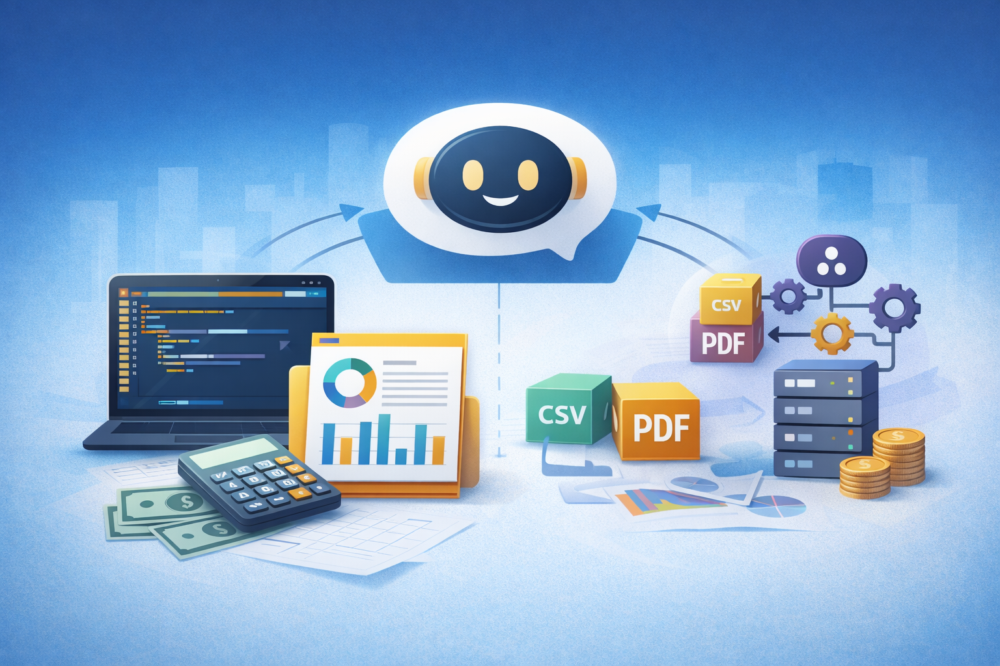

# Ways to Use Claude: Choosing the Right Interface

*A practical guide for accounting and finance professionals getting started with AI*

---

**By Svetlana Toohey**
*Published March 2026*

Many professionals hear about Claude and assume it's just another chatbot.

In reality, Claude can be used through several different interfaces -- each one offering a different level of capability. Understanding these options helps you move from simply asking AI questions to actually working alongside AI as a co-pilot.

Below is a simple overview of the three primary ways to interact with Claude.


*From manual analysis to automated workflows -- Claude can assist at every stage.*

---

## Overview: Claude Interfaces


*Figure 1: The three ways to interact with Claude, from beginner to advanced.*

Think of these as levels of capability rather than complexity.

Most professionals start at Level 1 and gradually move toward Level 2.

---

## 1. Claude Web Interface

The easiest way to start.

The browser interface at Claude's website allows anyone to begin using AI immediately -- no software installation required.

**Typical Uses**

- Asking research questions
- Summarizing documents
- Brainstorming ideas
- Drafting emails or reports
- Reviewing spreadsheets or PDFs

**What works well**

- No setup required
- Supports file uploads
- Good for quick, one-off tasks

**Where it falls short**

- Work is mostly manual
- Limited automation
- Harder to scale for larger projects

**Example for Finance Professionals**

Upload a trial balance or CSV export and ask:

```
"Summarize unusual variances."
```

```
"Identify large changes month-over-month."
```

```
"Explain potential drivers of margin decline."
```

This is where most people first experience the power of AI.

---

## 2. IDE Integration (Claude inside VS Code)

This is where things become truly transformative.

Instead of chatting in a browser, Claude can assist directly inside Visual Studio Code. This approach allows you to collaborate with AI while building real, reusable tools.

**Typical Uses**

- Writing Python scripts
- Cleaning large datasets
- Building dashboards
- Automating reporting workflows
- Debugging code

**What works well**

- Works directly with project files
- Enables automation
- Handles large datasets
- Ideal for analytics and financial modeling

**Example for Accounting**

Claude can help generate Python scripts to:

- reconcile bank transactions
- classify expenses
- analyze margins by product
- generate KPI dashboards

This is the approach at the heart of PythonMuse -- helping finance professionals move from AI user to AI collaborator.

If your corporate environment requires IT approval before VS Code can be installed, [Getting the Right Tools Installed](../03-getting-the-right-tools-installed/) addresses how to approach that conversation.

---

## 3. Claude API (Embedding AI in Applications)

The most advanced interface is the Claude API.

This allows developers to integrate Claude into software products, internal tools, or automated workflows.

**Typical Uses**

- Automated document processing
- Financial analysis platforms
- Custom internal reporting tools

**What works well**

- Fully automated workflows
- Integrates with internal systems
- Highly scalable

For most finance professionals, the API layer is not the first step -- but it becomes relevant once automation projects grow.

---

## A Simple Mental Model

| Interface | Best For | Skill Level |
|-----------|----------|-------------|
| Web Chat | Learning and quick tasks | Beginner |
| VS Code Integration | Data work and automation | Intermediate |
| API | Building AI systems | Advanced |


---

## Try This in 5 Minutes

If you're completely new to AI tools:

1. Open Claude in your browser
2. Upload a small CSV file -- a trial balance or sales export works well
3. Ask:

```
Identify unusual transactions or large changes month-over-month.
Explain possible reasons.
```

Then imagine what would happen if that analysis ran automatically every week.

That is the difference between chatting with AI and working with AI inside tools like Visual Studio Code.

---

## The Real Shift

Many professionals think AI adoption begins with asking better prompts.

In reality, the bigger shift happens when you begin working with AI inside your tools.

That is when AI becomes less of a chatbot -- and more of a true co-pilot for analysis, automation, and problem solving.

If you're curious how to take the next step, the [hands-on walkthrough in Article 01](../01-ai-copilot-for-accounting/) shows exactly how this works in practice -- two CSV files, plain English questions, and a real margin analysis built inside VS Code.

---

*By Svetlana Toohey*

*Related: [Getting the Right Tools Installed](../03-getting-the-right-tools-installed/) | [Your AI Co-Pilot for Accounting](../01-ai-copilot-for-accounting/) | [AI in Accounting Is Not the Wild West Anymore](../04-ai-governance-in-accounting/)*
