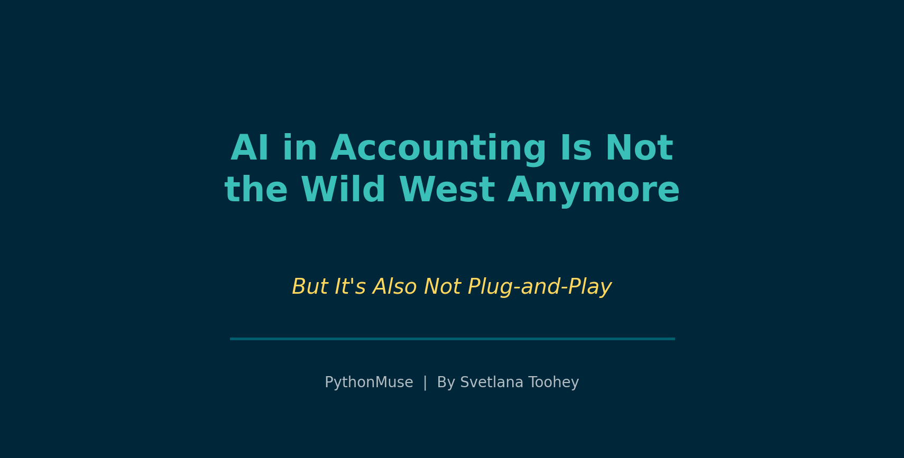
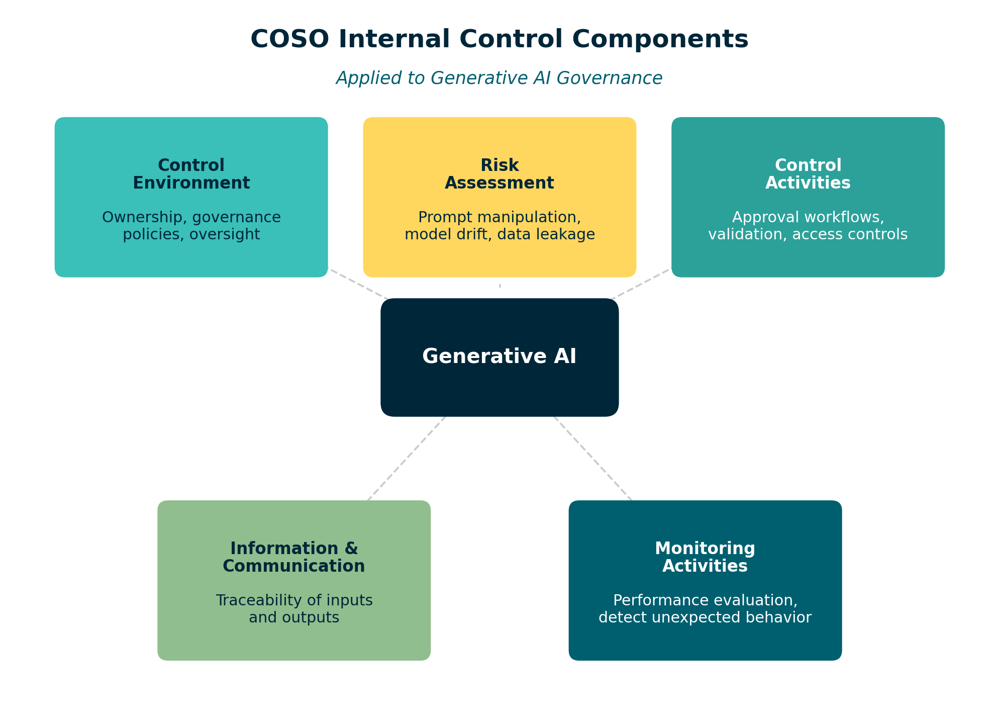
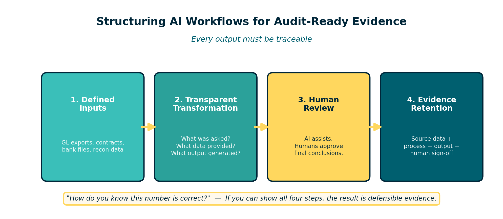

# AI in Accounting Is Not the Wild West Anymore

*But It's Also Not Plug-and-Play*

---

**By Svetlana Toohey**
*Published March 2026*

For the past year, many finance teams have been quietly experimenting with AI.

It usually starts with harmless questions:

- "Can you summarize this contract?"
- "Can you categorize these transactions?"
- "Can you draft variance commentary for the monthly report?"

Then someone asks the question that makes the entire room slightly uncomfortable:

"If AI helped produce this... will the auditors accept it?"

Fair question.

Accounting is not known for its enthusiasm toward mysterious black boxes.

The good news is that the profession is beginning to build real guardrails around AI use in business processes.

The less exciting news is that there is still no official rulebook titled:

*How to Let ChatGPT Touch Your Close Without Giving Your Auditor Heartburn.*

We are currently in a transition phase where regulators, accounting firms, and professional organizations are converging around the same principle:

**AI can be used responsibly in accounting -- but it must operate inside existing governance and control frameworks.**

Let's unpack what that actually means.

---

## What the Accounting Rulebook Actually Says (So Far)

One of the biggest misconceptions right now is that regulators have already issued detailed rules governing AI-generated accounting outputs.

They haven't.

There is currently no FASB Accounting Standards Update specifically addressing AI-generated financial information.

Even the recent update to internal-use software accounting (ASU 2025-06) acknowledges that existing accounting guidance does not specifically address AI model development or training costs.

In other words:

**The standards have not yet caught up to the technology.**

But that does not mean AI sits outside the accounting rulebook.

Instead, regulators are applying existing principles to new technology.

Three frameworks currently shape how AI should be used in accounting environments:

- **Accounting standards** (FASB)
- **Audit standards** (PCAOB / AICPA)
- **Internal control frameworks** (COSO)

Together, these provide the guardrails.

---

## Technology-Assisted Auditing

The PCAOB recently updated auditing standards to address the growing use of technology-assisted analysis of electronic data.

These amendments become effective for audits of fiscal years beginning December 15, 2025.

What does this mean in practice?

Auditors are increasingly expected to analyze entire data populations, rather than relying only on sampling.

Technology tools -- including analytics and automation -- are becoming normal parts of audit procedures.

This does not mean auditors suddenly trust AI outputs automatically.

It means the profession is moving toward more structured, data-driven evidence rather than screenshots and spreadsheets.

Which brings us to one of the most important developments.

---

## COSO's New Guidance for Generative AI

In February 2026, COSO released new guidance called:

**"Achieving Effective Internal Control Over Generative AI."**

You can explore the framework here:
[https://www.coso.org/generative-ai](https://www.coso.org/generative-ai)

This publication is one of the most practical resources currently available for organizations integrating AI into business workflows.

Instead of creating a brand-new governance model, COSO did something refreshingly practical.

It showed how Generative AI risks can be governed using the existing COSO Internal Control -- Integrated Framework.

That means applying the same five familiar components already used for financial reporting and SOX compliance:

**Control Environment**
Define ownership, governance policies, and oversight of AI systems.

**Risk Assessment**
Identify risks such as prompt manipulation, model drift, opaque reasoning, and data leakage.

**Control Activities**
Implement approval workflows, validation checks, and access controls.

**Information & Communication**
Ensure traceability of AI inputs, outputs, and decisions.

**Monitoring Activities**
Continuously evaluate performance and detect unexpected behavior.

In other words:

**AI does not replace internal control. It becomes another system operating inside it.**

For finance teams, this is extremely important.

It means AI workflows can be made audit-ready when they are designed inside a structured control environment.

*Figure: The five COSO IC components applied to Generative AI governance.*

---

## What the Big Four Are Saying

While regulators move cautiously, the Big Four accounting firms have already published guidance on how AI should be adopted within finance functions.

Across Deloitte, PwC, EY, and KPMG, the recommendations are remarkably consistent.

Controllers should:

- maintain an inventory of AI tools used in finance
- classify how each tool interacts with financial data
- ensure human oversight of accounting conclusions
- document inputs and outputs
- integrate AI workflows into internal control over financial reporting

Notice something interesting.

None of these recommendations say:

*"Don't use AI."*

They say:

**Use AI -- but govern it properly.**

---

## The Real Risk Isn't AI

The real risk is messy processes.

Let's be honest.

Many accounting workflows already depend on:

- massive Excel workbooks
- manual exports
- copy-paste transformations
- undocumented formulas
- filenames like `final_v8_THIS_ONE_FOR_REAL.xlsx`

If anything, AI adoption is forcing the profession to confront an uncomfortable truth:

**If the workflow is messy, AI will simply replicate the mess faster.**

Which brings us to the practical question.

---

## How Controllers Should Structure AI Workflows

The simplest principle is this:

**Every output must be traceable.**

An AI-supported accounting workflow should include four elements:

*Figure: Four elements of an audit-ready AI workflow.*

### 1. Defined Inputs

Source data must be identifiable and preserved.

Examples include:

- GL exports
- contract documents
- bank transaction files
- reconciliation data

The key question: *Could someone later verify exactly what data the model saw?*

### 2. Transparent Transformation

If AI summarizes or analyzes information, the process must be understandable.

You do not need to reverse-engineer the entire neural network.

But you should know:

- what question was asked
- what data was provided
- what output was generated

### 3. Human Review

AI can assist.

But it should not make final accounting decisions.

AI can help with:

- drafting commentary
- summarizing contracts
- categorizing transactions

Humans should still approve:

- journal entries
- accounting treatments
- financial disclosures

### 4. Evidence Retention

Finally, retain enough information to answer the auditor's favorite question:

*"How do you know this number is correct?"*

If you can show:

- source data
- transformation process
- AI output
- human review

Then the result becomes defensible evidence, not a mysterious artifact.

---

## Learning More About AI Governance

As AI adoption grows, many professionals are looking for structured ways to learn how AI governance works in practice.

Several professional programs now focus specifically on AI oversight.

### Recommended Training

**Auditing Artificial Intelligence (AI): A Hands-On Course**
Institute of Internal Auditors
Focus: AI governance frameworks, risk evaluation, control testing

**Essentials for AI Auditing**
Institute of Internal Auditors
Focus: AI risk taxonomy and governance structures

**ChatGPT & Internal Audit: Governance of Generative AI**
Institute of Internal Auditors
Focus: controls around LLM usage and AI documentation

**COSO Internal Control Certificate Program**
Focus: applying the COSO framework to governance and monitoring

These programs are valuable because they connect AI governance with internal control frameworks already used in financial reporting.

---

## One Final Thought

The goal of AI in accounting is not to eliminate professional judgment.

The goal is to eliminate the parts of the job that never required judgment in the first place.

Sorting transactions. Summarizing documents. Drafting explanations. Reconciling large data sets.

If AI can take those tasks off our plates, accountants can spend more time doing what actually matters:

**Understanding the business and explaining the numbers.**

And fortunately, that is still something AI cannot do nearly as well as a good controller.

---

*Related: [Your AI Co-Pilot for Accounting](../01-ai-copilot-for-accounting/) | [Getting the Right Tools Installed](../03-getting-the-right-tools-installed/) | [Reproducible Accounting](../05-reproducible-accounting/) | [AI Governance for Controllers](../07-ai-governance-for-controllers/)*
