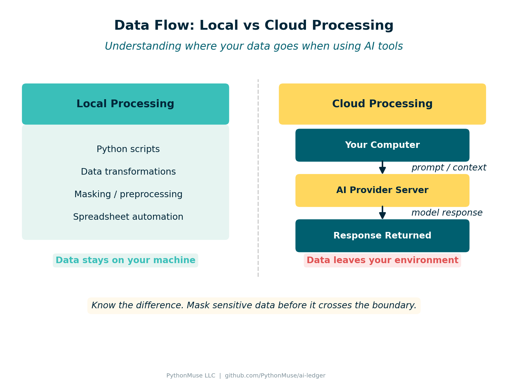
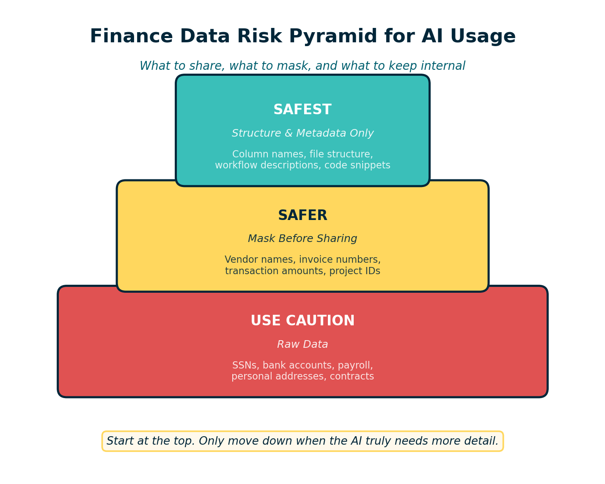
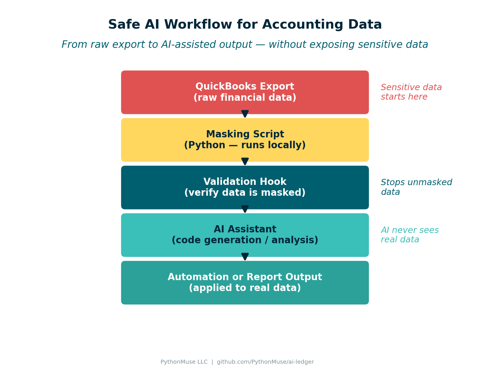

# How to Use AI in Accounting Without Sending the Wrong Data

*A practical guide to data boundaries, masking, and safe AI workflows for finance teams*

---

**By Svetlana Toohey**
*Published March 2026*

In the previous PythonMuse article, we focused on the first barrier to modern finance automation:

Getting the right tools installed.

Tools like Python, Visual Studio Code, and AI assistants can dramatically improve how accounting teams analyze data and automate repetitive work. But once those tools are available, the next question quickly follows:

**How do we use AI without accidentally sending sensitive financial data to the wrong place?**

This is where many organizations hesitate. The concern is understandable. Accounting teams work with information that includes:

- client data
- vendor payments
- payroll records
- internal budgets

So before experimenting with AI-assisted workflows, it helps to understand two important ideas:

**Where AI processing happens** and **what data should be shared.**

---

## Local Processing vs Cloud Processing

One of the biggest misconceptions about AI tools is that everything runs locally on your computer.

In reality, there are two different models.

### Local Processing

Some tools run entirely on your machine.

Examples include:

- Python scripts
- local data transformations
- data masking or preprocessing
- spreadsheet automation

In these cases, the data never leaves your computer or internal environment.

### Cloud Processing

Many AI assistants work differently.

When you ask an AI model to analyze text, generate code, or interpret a file structure, your request may be sent to cloud-hosted servers where the model runs.


*Figure: How data moves between your computer and AI services.*

In most enterprise AI services, the data is processed temporarily to generate a response. Some services retain short-term logs for system monitoring, and many enterprise plans specify that customer data is not used to train models.

Even so, organizations should carefully consider what information they allow to be sent for processing.

---

## A Simple Rule: Mask Locally First

One of the most effective safeguards is simple:

**Transform sensitive information before sharing it with AI tools.**

Instead of sending real financial records, prepare a masked or synthetic version of the dataset locally.

Examples include:

- replacing real client names with placeholders
- randomizing financial amounts
- removing personal identifiers
- sharing only file structure information

This way, the AI model can still help with tasks like:

- understanding file layouts
- generating automation scripts
- documenting workflows

But the underlying confidential data remains protected.

---

## Safe, Safer, and Safest AI Workflows

Accounting teams do not need to avoid AI entirely. Instead, it helps to think of AI usage as a spectrum.


*Figure: Three tiers of data safety when working with AI tools.*

### Safest: Structure and Metadata Only

In many cases, the AI model does not need actual data at all.

You can share things like:

- column names
- file structure
- sample rows with synthetic values
- workflow descriptions

Example prompt:

```
I have a CSV file with columns for Invoice_Number, Vendor_ID,
Transaction_Date, and Amount.
Please generate Python code to document the file structure
and validate required fields.
```

This approach keeps all real financial data internal.

### Safer: Masked Data

Sometimes the AI needs to see example records to generate better logic.

In those cases, prepare a masked dataset first.

Example transformation:

| Field | Original | Masked |
|-------|----------|--------|
| Vendor | ABC Construction | Vendor_01 |
| Amount | $12,458 | $8,200 |

The structure remains intact, but sensitive details are removed.

### Use Caution: Raw Data

Sending raw financial data to external AI systems introduces additional risk and should be considered carefully.

Examples include:

- payroll data
- customer information
- bank account numbers
- personally identifiable information

Many organizations prohibit sharing these categories with AI tools unless specific approvals are in place.

---

## A Simple Data Classification Approach

One practical way to guide AI usage is to categorize finance data into three groups.

### Category 1 -- Safe for AI

Generally safe to share:

- file structures
- column names
- workflow descriptions
- documentation drafts
- code snippets

### Category 2 -- Mask Before Sharing

Use masking or anonymization first:

- vendor names
- invoice numbers
- transaction amounts
- internal project identifiers

### Category 3 -- Do Not Share

Avoid sending to external AI systems:

- social security numbers
- bank account details
- payroll records
- personal addresses
- confidential contracts

This simple classification helps teams experiment with AI responsibly.

---

## Practical Demo: Safe AI Workflow for Accounting Data

Let's walk through a complete example. We'll show how an accounting team could safely use AI to help analyze a QuickBooks-style report without sending sensitive data to the cloud.

### Step 1 -- Sample Accounting Data

Many accounting systems export reports like this:

```csv
Transaction_ID,Date,Vendor,Account,Description,Amount
1001,2025-01-01,ABC Construction,Repairs & Maintenance,Roof repair,12450
1002,2025-01-03,Staples,Office Supplies,Printer paper,320
1003,2025-01-04,Delta Airlines,Travel,Flight to conference,850
1004,2025-01-05,ADP Payroll,Payroll Expense,Payroll processing,24500
1005,2025-01-08,Office Depot,Office Supplies,Desk chair,475
1006,2025-01-10,United Healthcare,Insurance,Monthly premium,8900
1007,2025-01-12,FedEx,Shipping,Client deliverables,210
1008,2025-01-15,ComEd,Utilities,Electric bill,1850
1009,2025-01-18,ABC Construction,Repairs & Maintenance,HVAC service,6200
1010,2025-01-20,ADP Payroll,Payroll Expense,Payroll processing,24500
```

This file is available at [`data/qb_raw_export.csv`](./data/qb_raw_export.csv).

This file contains sensitive information: vendor names, transaction amounts, and internal accounts. This is not what we want to send to AI.

### Step 2 -- Mask the Data Locally

Before sharing anything with AI, we run a masking script that replaces sensitive values:

```python
# data/mask_finance_data.py
import pandas as pd
import random

def mask_finance_file(input_file, output_file):
    df = pd.read_csv(input_file)

    vendor_map = {v: f"Vendor_{i:02d}"
                  for i, v in enumerate(df["Vendor"].unique(), start=1)}
    df["Vendor"] = df["Vendor"].map(vendor_map)

    df["Amount"] = df["Amount"].apply(lambda x: round(random.uniform(100, 10000), 2))

    df.to_csv(output_file, index=False)
    print(f"Masked file created: {output_file}")

if __name__ == "__main__":
    mask_finance_file("qb_raw_export.csv", "qb_masked_export.csv")
```

This script is available at [`data/mask_finance_data.py`](./data/mask_finance_data.py).

The masked output looks like this:

```csv
Transaction_ID,Date,Vendor,Account,Description,Amount
1001,2025-01-01,Vendor_01,Repairs & Maintenance,Roof repair,5320.45
1002,2025-01-03,Vendor_02,Office Supplies,Printer paper,410.20
1003,2025-01-04,Vendor_03,Travel,Flight to conference,2890.00
1004,2025-01-05,Vendor_04,Payroll Expense,Payroll processing,7150.30
```

The structure remains intact, but sensitive data is removed.

### Step 3 -- Validate Before Sending

Before sending anything to AI, we enforce a masking verification step:

```python
# data/verify_masking.py
import pandas as pd
import re

def verify_file_is_masked(file_path):
    df = pd.read_csv(file_path)

    vendor_pattern = r"^Vendor_\d+$"
    for v in df["Vendor"]:
        if not re.match(vendor_pattern, str(v)):
            raise ValueError(f"Unmasked vendor name detected: {v}")

    print("File passed masking validation.")

if __name__ == "__main__":
    verify_file_is_masked("qb_masked_export.csv")
```

This script is available at [`data/verify_masking.py`](./data/verify_masking.py).

If the file contains real vendor names like "ABC Construction" or "Delta Airlines", the script stops the workflow before anything is sent externally.

For more examples of control hooks and data handling patterns, see the [AI Accounting Framework: Hooks as Controls](https://github.com/PythonMuse/pythonmuse-ai-accounting-framework/tree/main/06-hooks-as-controls).

### Step 4 -- AI Processing

Once the file is verified as masked, it can safely be used with AI.

Example prompt to Claude:

```
I have a masked accounting transaction file with the following columns:
Transaction_ID, Date, Vendor, Account, Description, Amount.

Please generate Python code that summarizes total spending by account category.
```

The AI can now help with analysis logic, visualization, and documentation -- but it never sees real financial data.


*Figure: Complete workflow from raw data to AI-assisted output.*

---

## Boundaries and Preprocessing

In practice, many organizations implement a simple workflow:

1. Export financial data from the accounting system
2. Run local preprocessing (masking and anonymization)
3. Use AI assistance for code generation and documentation
4. Apply automation scripts internally to the real data

This approach allows finance teams to benefit from AI while maintaining strong data governance.

In fact, similar models are already used when companies share information with consultants, auditors, payroll processors, and shared service centers.

The key difference is not whether data leaves the organization, but **how that data is governed and protected.**

---

## Project Structure

The complete demo is organized in this article's folder:

```
articles/06-safe-ai-data-workflows/
├── README.md                    ← this article
├── visuals/                     ← diagrams and infographics
├── data/
│   ├── qb_raw_export.csv        ← sample QuickBooks-style export
│   ├── qb_masked_export.csv     ← masked version (AI-safe)
│   ├── mask_finance_data.py     ← masking script
│   └── verify_masking.py        ← validation hook
└── generate_visuals.py          ← reproduce all visuals
```

---

## The Goal Is Responsible Adoption

AI tools can dramatically improve productivity in accounting. They can help teams:

- understand messy data exports
- automate repetitive tasks
- document processes
- build more reliable workflows

But responsible adoption means understanding what information should be shared and what should remain internal.

Starting with simple guardrails -- such as masking data locally and sharing only what is necessary -- allows finance teams to explore AI safely.

**Responsible AI adoption in finance is not about avoiding the technology. It is about designing workflows where sensitive data stays protected while the tools still help us work smarter.**

---

*Related: [Getting the Right Tools Installed](../03-getting-the-right-tools-installed/) | [AI in Accounting Is Not the Wild West Anymore](../04-ai-governance-in-accounting/) | [AI Governance for Controllers](../07-ai-governance-for-controllers/) | [AI Accounting Framework](https://github.com/PythonMuse/pythonmuse-ai-accounting-framework)*
