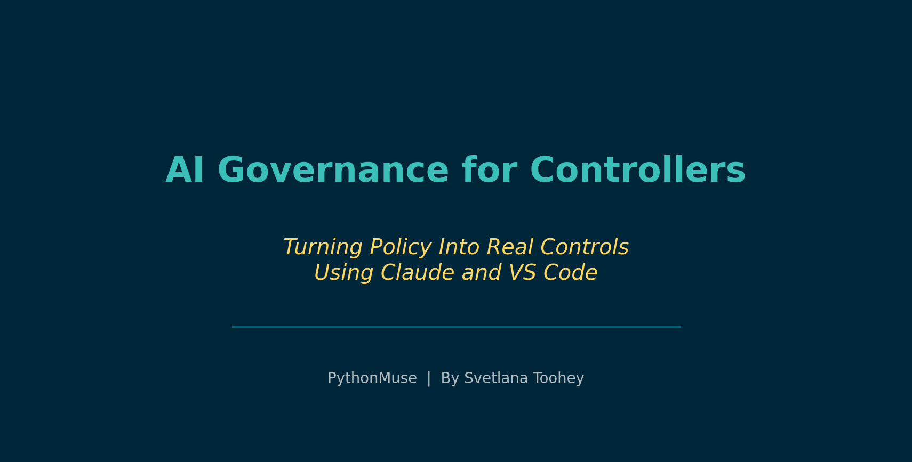
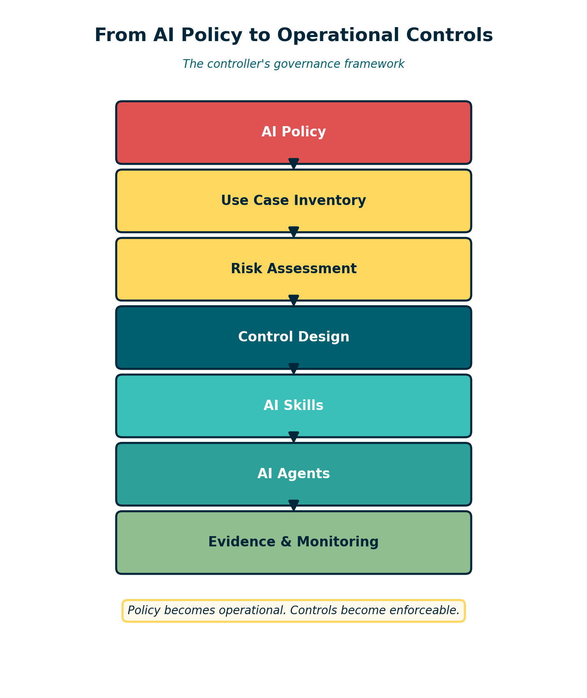
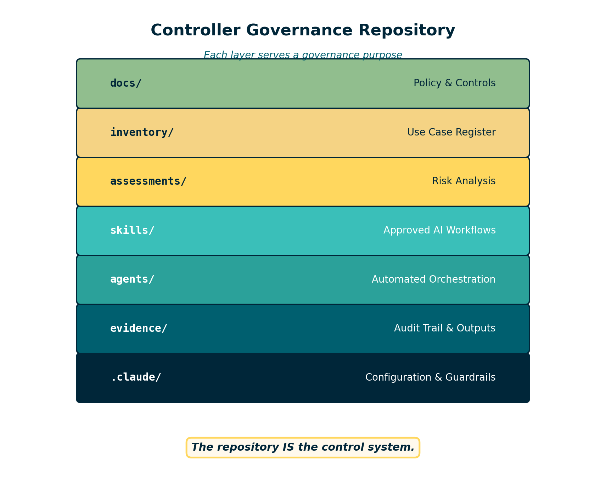

# AI Governance for Controllers

*Turning policy into real controls using Claude and VS Code*

---

**By Svetlana Toohey**
*Published March 2026*



In previous PythonMuse articles, we covered AI governance frameworks, reproducible accounting workflows, and how to use AI without sending the wrong data. Those articles addressed important questions: What are the rules? How should workflows be structured? What data stays local?

But if you are a controller trying to actually implement those ideas, a very practical question appears almost immediately:

**Where do the controls actually live?**

Policies are written in documents. AI tools live inside software environments like VS Code. And the bridge between those two worlds is rarely explained.

This is the gap many finance teams are running into right now. Controllers understand internal controls very well. We know how to document policies, define approvals, and build review processes. But when AI enters the picture, governance often stops at the policy stage. The operational system that actually enforces those rules is missing.

This article describes a practical approach for closing that gap.

---

## The Controller's Real Problem

When a finance team starts experimenting with AI tools like Claude inside VS Code, several control questions appear almost immediately:

- Which AI use cases are approved?
- What data is allowed to be analyzed?
- How do we prevent sensitive information from being exposed?
- How do we track changes to AI workflows?
- How do we maintain an audit trail of AI-assisted work?

Without a structure to manage these questions, AI governance becomes a static document rather than a functioning control system.

The challenge is not writing the policy. The challenge is operationalizing it.

---

## A Practical Approach: Governance Inside the Repository

One way to solve this is to place the governance framework directly inside the same environment where AI workflows are developed.

Instead of separating policy documents from the tools being used, the governance system itself can live inside the project repository that powers the AI workflows.

In practical terms, this means using:

- Markdown files for policies and documentation
- A repository to track AI use cases and risk assessments
- Project configuration to enforce guardrails
- Reusable AI "skills" to standardize workflows
- Version control to maintain change history

When structured properly, the repository becomes a living control system.


*Figure: The governance flow from policy to evidence.*

The flow looks something like this:

**Policy --> Inventory --> Risk Assessment --> Controls --> Skills --> Agents --> Evidence.**

Controllers already understand this pattern. It mirrors how we manage other operational processes. The difference is that the control framework is now integrated directly with the technology that executes the workflow.

---

## What the Structure Looks Like

A simple starting structure might look like this:

```
finance-ai-governance/
  docs/              policy and control documentation
  inventory/         AI use case register
  assessments/       risk assessments
  skills/            approved AI workflows
  agents/            automated task orchestration
  evidence/          audit trail and outputs
  .claude/           configuration and guardrails
```


*Figure: Repository structure as a controller governance system.*

Each component plays a role in the governance system:

- **docs/** contains the finance AI policy, data classification rules, and the control matrix.
- **inventory/** maintains a register of approved AI use cases.
- **assessments/** holds a documented risk assessment for each approved use case.
- **skills/** stores reusable instructions that define how Claude should perform a specific task.
- **agents/** can later orchestrate multiple skills to automate a larger workflow.
- **evidence/** captures documented output from every AI workflow run for controller review.
- **.claude/** holds project configuration files that enforce guardrails and prevent access to sensitive folders.

When combined, these components transform governance from a document into a working system.

---

## Start Small: One Use Case

One of the biggest mistakes organizations make with AI adoption is trying to implement everything at once.

A better approach is to begin with a single controlled use case.

For many finance teams, a good candidate might be bank reconciliation review. In that workflow:

- The use case is registered in the inventory.
- A risk assessment is completed.
- A skill is created to analyze reconciliation data.
- Claude assists with identifying reconciling items or generating variance explanations.
- Output is saved as evidence for controller review.

The AI is not posting transactions or altering financial records. It is assisting analysis within a controlled boundary.

Over time, additional workflows can be added once the governance structure is proven to work. This is the same incremental approach we use when rolling out any new process in accounting -- start narrow, validate, then expand.

---

## Why This Matters

As AI tools become more common inside finance organizations, the real differentiator will not be who has access to the technology. It will be who can operate it responsibly.

Frameworks like the COSO generative AI guidance emphasize governance, inventory, monitoring, and accountability. Those principles are essential, but they need an operational structure to support them.

By embedding governance directly into the development environment, finance teams can create a system where:

- Approved workflows are documented
- Risk assessments are linked to each use case
- AI instructions are standardized
- Outputs are retained as evidence
- Changes are tracked through version control

In other words, the control framework evolves alongside the technology.

---

## A Practical Starting Point

To demonstrate this concept, I am building a companion starter repository that shows how a controller-led AI governance structure can be implemented using Claude and VS Code.

The repository will include:

- A sample finance AI policy
- A use case inventory template
- A risk assessment structure
- Example AI skills
- A simple agent workflow
- An evidence and audit trail structure

It will be published at [PythonMuse/finance-ai-governance](https://github.com/PythonMuse/finance-ai-governance) when ready.

These are meant as starting points. Every organization will need to adapt the structure to fit its own policies, risk appetite, and tools. But the core idea is the same: governance should live where the work happens.

---

## Final Thoughts

AI adoption in accounting does not start with automation. It starts with structure.

Controllers are uniquely positioned to lead this effort because we already understand how operational systems and internal controls must work together.

If we approach AI the same way we approach any other financial process -- with inventory, governance, monitoring, and evidence -- the technology becomes far less mysterious. It simply becomes another tool operating inside a well-designed control environment.

And that is where responsible AI adoption in finance truly begins.

---

*Related: [AI in Accounting Is Not the Wild West Anymore](../04-ai-governance-in-accounting/) | [Reproducible Accounting](../05-reproducible-accounting/) | [How to Use AI in Accounting Without Sending the Wrong Data](../06-safe-ai-data-workflows/)*
