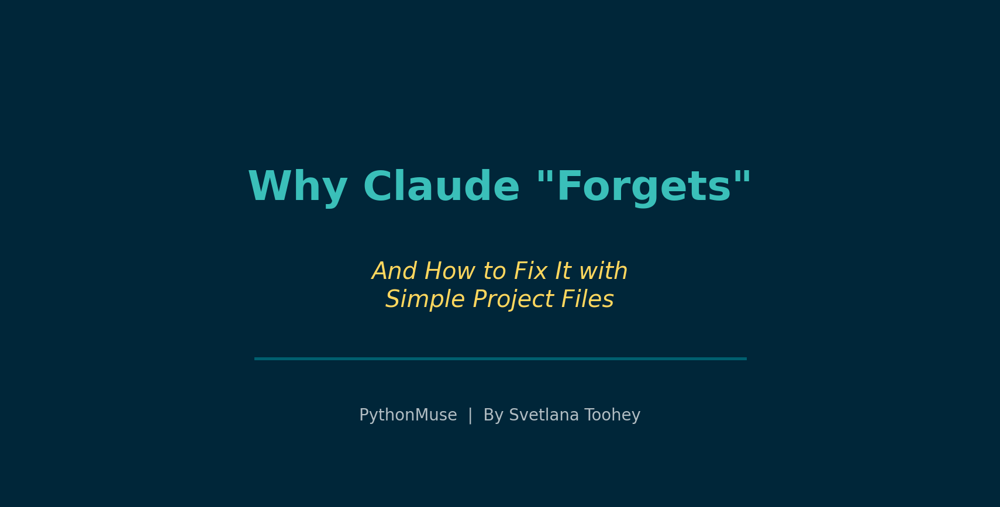
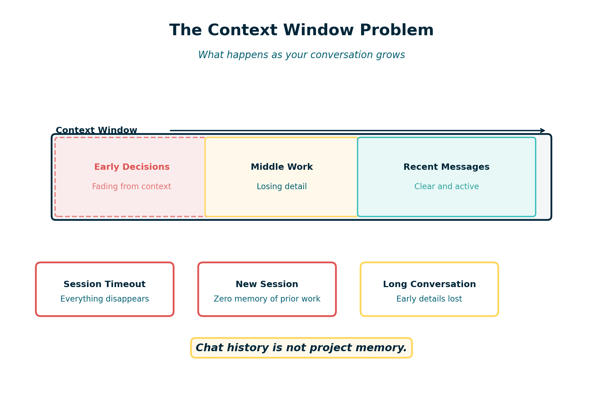
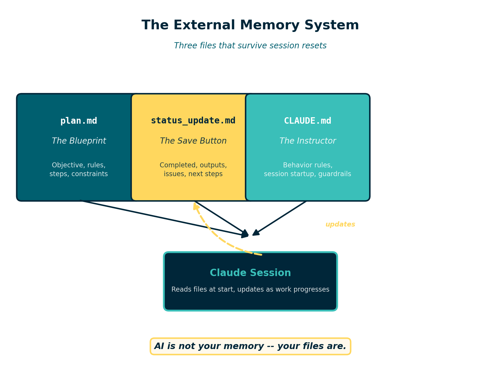

# Why Claude "Forgets" -- And How to Fix It with Simple Project Files

*Giving your AI a memory that survives the conversation*

---

**By Svetlana Toohey**
*Published March 2026*



Every accountant has a doomsday story about Excel.

You are three hours deep into a consolidation workbook. Forty tabs. Hundreds of formulas. You stand up to get coffee, and when you come back the screen is frozen. You force-quit. The recovery file is corrupted. Three hours of work -- gone.

We learned the hard way to save constantly. Ctrl+S became muscle memory.

AI has the exact same problem. Except most people do not realize it until it is too late.

---

## The Day My 401(k) Workflow Disappeared

I was building a 401(k) match validation workflow with Claude. The process was going well. We had defined the matching rules, built the logic to compare payroll data against plan documents, and were partway through generating the output reports.

I went to get coffee. Came back. The chat window was blank.

No history. No outputs. No record of the decisions we had made together. No idea which files had been created or whether the logic was complete.

It was my Excel crash moment -- but worse. With Excel, at least I knew what I had been building. With the AI session, I could not even remember every instruction I had given or every assumption we had agreed on.

That experience changed how I work with AI permanently.

---

## Why This Happens

Claude -- like all large language models -- operates inside something called a **context window**. Think of it as the AI's working memory. Everything you type, everything Claude responds with, every piece of data you share -- it all lives inside that window.


*Figure: The context window is finite. As conversations grow longer, earlier decisions and instructions fall out of scope or the session ends entirely.*

The context window is large, but it is not infinite. As a conversation gets longer, several things can happen:

- **The session times out or disconnects.** You lose everything.
- **Earlier messages fall out of effective range.** Claude can still technically "see" them, but starts to lose track of details from the beginning of the conversation.
- **You start a new session.** Claude has zero memory of any previous conversation. None.

This is not a bug. It is how the technology works. Claude does not have a persistent memory bank that carries information between sessions. Every conversation starts from scratch.

For casual use, this is fine. For accounting workflows -- where precision, traceability, and reproducibility matter -- it is a serious problem.

---

## Why Accountants Should Care

In accounitng, we do not just need results. We need to know:

- **What was done.** Which files were analyzed? What transformations were applied?
- **How it was done.** What logic drove the calculations? What assumptions were made?
- **Where the outputs are.** Which files were created? Where are they saved?
- **Whether anything went wrong.** Were there errors? Data quality issues? Edge cases?

When your AI assistant forgets everything the moment a session ends, you lose all of that context. You are left reverse-engineering your own work -- exactly the kind of detective work we try to eliminate in modern accounting.

This is the same problem we solved decades ago with workpapers. We do not rely on memory to reconstruct an audit. We rely on documentation.

AI needs the same discipline.

---

## The Fix: External Memory Files

The solution is surprisingly simple. **Stop relying on chat history as your project memory.** Instead, create a small set of files that persist outside the conversation -- files that Claude can read at the start of every session and update as work progresses.

I call this the "external memory" pattern, and it requires just three files.


*Figure: Three files -- plan.md, status_update.md, and CLAUDE.md -- form a persistent memory system that survives session resets.*

### 1. plan.md -- The Project Blueprint

This file defines what you are building. It includes:

- The objective of the project
- Key rules and requirements
- The steps to complete the work
- Input files and expected outputs
- Any constraints or assumptions

Think of it as a memo to your future self -- and to Claude. When a session ends and you start a new one, Claude reads this file and immediately understands the full scope of the project.

### 2. status_update.md -- The Save Button

This is the file that tracks progress. It answers:

- What has been completed so far?
- What outputs have been generated?
- Were there any issues or errors?
- What are the next steps?

Every time you reach a meaningful milestone during a session, you ask Claude to update this file. It becomes your rolling checkpoint -- the equivalent of Ctrl+S for AI work.

### 3. CLAUDE.md -- The Instruction Manual

This file tells Claude how to behave in this project. It includes instructions like:

- "Always read plan.md at the start of a session."
- "Update status_update.md after completing each major step."
- "Never modify raw data files."
- "Save all outputs to the /outputs folder."

When Claude opens a project that contains a CLAUDE.md file, it reads those instructions automatically. This means you do not have to re-explain your preferences and rules every single time.

---

## Recommended Folder Structure

A well-organized AI project folder might look like this:

```
ai-project/
  CLAUDE.md             instructions for Claude
  plan.md               project blueprint
  status_update.md      rolling progress tracker

  data/
    raw/                original source files (never modified)
    processed/          cleaned or transformed data

  src/                  scripts and logic files

  outputs/              generated reports and results

  docs/                 notes, memos, reference material
```

The key principle is separation. Raw data stays untouched. Outputs go to a dedicated folder. The three memory files sit at the project root where Claude can always find them.

A complete starter template using this structure is available at [examples/ai-project-memory](../../examples/ai-project-memory/).

---

## Prompts That Make It Work

The external memory system only works if you actually use it. Here are the prompts I rely on at each stage of a session.

### Starting a New Session

> "Read plan.md and status_update.md. Summarize where we left off and what the next steps are."

This brings Claude up to speed immediately. No guessing. No re-explaining.

### During Work

> "We just finished building the matching logic. Update status_update.md with what was completed, any issues encountered, and what comes next."

Do this after every meaningful milestone. It takes seconds and saves hours.

### Saving Progress Before Ending a Session

> "Before we stop, update status_update.md with a full summary of today's session. Include all completed steps, output file locations, any open issues, and recommended next steps."

This is your end-of-session save. If the session crashes tomorrow, or if you come back to this project next week, everything is documented.

---

## What Changed: Before vs. After

**Before external memory:**

- Long sessions that eventually lost context
- No record of what Claude had done or decided
- Starting over from scratch after every session break
- Outputs scattered across folders with no clear documentation
- No way to hand the project to a colleague

**After external memory:**

- Every session starts with full project context
- Progress is documented as work happens
- Session crashes are inconvenient, not catastrophic
- Outputs are tracked with clear locations and descriptions
- Any team member can pick up the project and continue

The difference is not subtle. It is the difference between working from memory and working from documentation. Accountants already understand why that distinction matters.

---

## Why This Matters for Controllers

If you are responsible for overseeing AI-assisted workflows in your organization, this pattern addresses several concerns at once.

**Documentation.** The plan.md and status_update.md files create a natural audit trail. You can see what was intended, what was done, and what the results were.

**Traceability.** Every step is logged. If someone asks how a number was produced, the status file shows the sequence of operations and the files involved.

**Reproducibility.** Because the plan and instructions are captured in files, the workflow can be re-run. A new team member -- or a new Claude session -- can follow the same steps and arrive at the same results.

**Clear outputs.** The folder structure and status tracking ensure that generated files are organized and accounted for. Nothing is floating in an unnamed Downloads folder.

This is not a complicated governance framework. It is three Markdown files and a folder structure. But it transforms an AI conversation from something ephemeral into something auditable.

---

## Final Thought

AI is powerful. But it is not your memory.

Your files are.

The accountants who will get the most out of AI tools are not the ones who learn the fanciest prompts. They are the ones who build simple, disciplined structures around their work -- the same way we have always approached financial processes.

Save early. Save often. And give your AI the context it needs to pick up right where you left off.

---

*Related: [Reproducible Accounting](../05-reproducible-accounting/) | [How to Use AI in Accounting Without Sending the Wrong Data](../06-safe-ai-data-workflows/) | [AI Governance for Controllers](../07-ai-governance-for-controllers/)*
