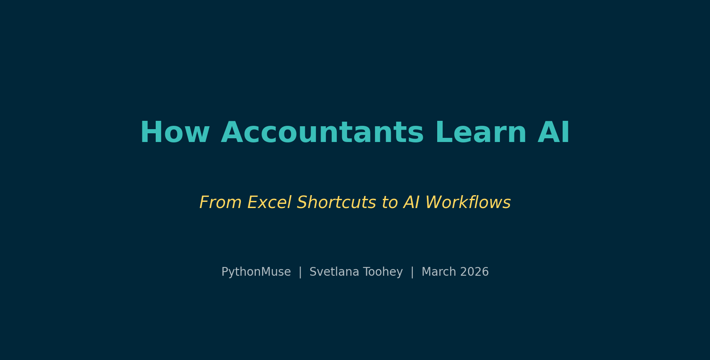
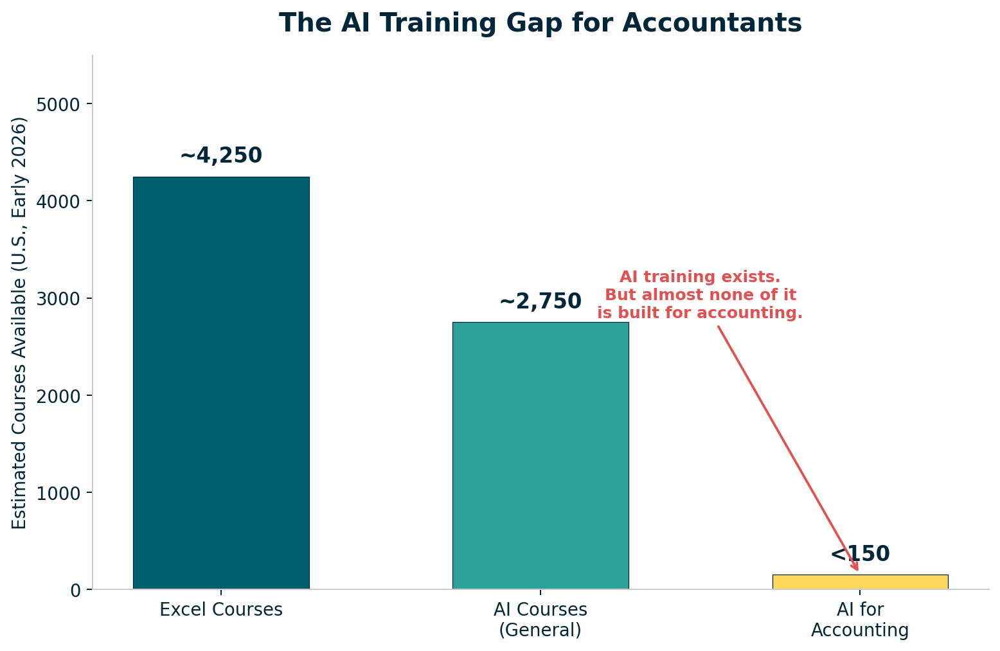

# How Accountants Learn AI -- From Excel Shortcuts to AI Workflows

*The same way we learned Excel: by experimenting, observing, building small workflows, and learning from each other.*

---

**By Svetlana Toohey**
*Published March 2026*



There was a time -- not that long ago -- when Excel felt overwhelming.

For some of us, that was 20+ years ago. For others, maybe 10. But we all remember it.

No one sat us down and said: "Here is everything you need to know about Excel."

That is not how we learned.

We learned by watching someone faster than us and asking "How did you do that?" We learned by copying formulas, breaking things, and finding shortcuts that made us feel like magicians.

And over time, Excel became second nature. Then it became expected. Then it became non-negotiable.

AI is in that exact same moment right now.

---

## The Training Landscape: A Reality Check

Here is the reality in the U.S. market as of early 2026:

| Category | Estimated Courses Available |
|----------|-----------------------------|
| Excel courses | ~3,500 -- 5,000 |
| AI courses (general) | ~2,000 -- 3,500 |
| AI for accounting | Less than 150 |


*Figure: AI training exists and is growing fast. But almost none of it is built for how accountants actually work.*

AI training exists. It is growing fast. But it is not designed for how we work in accounting.

There is no structured path like Excel had. No progression tied to real workflows. No focus on auditability, controls, or reproducibility.

---

## The Gap -- and the Opportunity

Excel evolved into something structured over time:

- Beginner: formulas and basic functions
- Intermediate: lookups, pivot tables, conditional logic
- Advanced: Power Query, dashboards, data models
- Expert: VBA, automation, integration

Clear expectations. Clear growth. Everyone knew what "good" looked like at each level.

AI training today looks more like:

- "What is ChatGPT?"
- "Write better prompts"
- "Build an app"

Useful content -- but disconnected from bank reconciliations, variance analysis, audit support, and financial reporting. Disconnected from the real work we do every day.

That disconnect is the gap. And it is also the opportunity.

---

## So How Do We Learn AI?

The same way we learned Excel.

Not by waiting for the perfect course. Not by sitting through a generic webinar.

By experimenting. By observing. By building small workflows. By learning from each other.

What follows is a practical map of what "learning AI" actually means for accountants -- each topic with a deeper companion resource you can explore.

---

## What "Learning AI" Actually Means for Accountants

### 1. Working With AI -- Not Just Prompting It

AI is not Google.

When you use AI effectively, you give context, refine instructions, review outputs, and iterate. Think of it like reviewing a staff accountant's work. The first draft is rarely the final answer. Your job is to direct, verify, and refine.

The difference between a useless AI response and an audit-ready one is not a better "prompt trick." It is the same thing that separates a vague email from a clear engagement letter: specificity.

For a deep dive with practical prompt progression examples -- including bank reconciliation and variance analysis walkthroughs: **[Working With AI](https://github.com/PythonMuse/pythonmuse-ai-accounting-framework/tree/main/01-working-with-ai)**

---

### 2. Why Markdown Matters

Markdown gives you structure, repeatability, and clarity. It replaces scattered notes with organized logic.

My opinion: move as much as you can to Markdown. It is the best-documented way to interact with AI. Everything AI tools read and produce is more reliable in Markdown than in any other format.

And here is a practical tip -- if you work with many PDFs, one of the first useful skills you should build is converting a specific PDF report to Markdown. That PDF becomes interactive with AI. More importantly, you may not need to convert all of it. Often you only need specific sections, which saves tokens and produces better results.

For Markdown syntax, accounting-specific templates (workpapers, close checklists), and a cheatsheet: **[Markdown for Accountants](https://github.com/PythonMuse/pythonmuse-ai-accounting-framework/tree/main/02-markdown-for-accountants)**

---

### 3. Why Python -- Without the Intimidation

You do not need to become a developer.

Python is valuable because it is readable, transparent, and audit-friendly. You do not need to write it from scratch. You need to understand what it is doing.

Compare to Excel -- you do not necessarily need to understand every nested formula, but you are able to follow the logic when you break it into chunks. The same applies to Python. Trust me -- I am not a developer, and I can follow the logic. That is all due to the amazing people who have contributed to open-source libraries that we will discuss further.

For line-by-line annotated scripts, sample accounting data, and a library guide: **[Python Without Intimidation](https://github.com/PythonMuse/pythonmuse-ai-accounting-framework/tree/main/03-python-without-intimidation)**

---

### 4. VS Code -- Your AI Workspace

Think of VS Code as "Windows Explorer for your AI workflows."

It is where files live, logic runs, and outputs are stored. It is free, maintained by Microsoft, and has become the standard environment for working with AI tools. For accountants, it is not about writing code -- it is about having a single organized workspace for your AI projects.

For setup guidance, recommended extensions, and a first-15-minutes walkthrough: **[VS Code as Your Workspace](https://github.com/PythonMuse/pythonmuse-ai-accounting-framework/tree/main/04-vscode-as-workspace)**

---

### 5. Understanding AI Permissions

AI tools may access files, execute code, and process data. You must understand what is happening and where your data goes.

This is where accountants naturally excel (no pun intended). We already think about data access controls, segregation of duties, and information boundaries. The same framework applies to AI tools. You just need to apply it.

For a local-vs-cloud checklist and an AI permission audit template: **[AI Permissions](https://github.com/PythonMuse/pythonmuse-ai-accounting-framework/tree/main/05-ai-permissions)**

---

### 6. Hooks -- Your Control Layer

Hooks are simple checks that run automatically before or after an AI action. "Do not process unless data is masked." "Warn before modifying raw data." "Log every file change."

This is how you integrate internal controls into AI workflows. The same maker-checker, approval-before-posting discipline you already use for journal entries and payments -- applied to AI.

For hook examples, a configuration walkthrough, and a design worksheet: **[Hooks as Controls](https://github.com/PythonMuse/pythonmuse-ai-accounting-framework/tree/main/06-hooks-as-controls)**

---

### 7. The Canary Concept

A simple control -- a known-answer test embedded in your project files. At the start of every session, ask: "What is the canary?" Correct answer means the environment is working. Wrong answer means something is off.

This one you can have a lot of fun with. Come up with the silliest question or the silliest answer and leave an easter egg in your workflow. It is your project -- make it yours.

For setup instructions, test prompts, and troubleshooting guidance: **[Canary Concept](https://github.com/PythonMuse/pythonmuse-ai-accounting-framework/tree/main/07-canary-concept)**

---

### 8. Project Hygiene 

Structure your work: plan.md, status_update.md, backlog.md, organized folders. You manage AI like a team member -- with clear scope, tracked progress, and organized deliverables.

This is what separates a chaotic AI experiment from a reliable AI workflow. Three Markdown files and a folder structure. That is it.

For complete examples (a realistic bank reconciliation project in three sessions), ready-to-copy templates, and folder scaffolding: **[Project Hygiene](https://github.com/PythonMuse/pythonmuse-ai-accounting-framework/tree/main/08-project-hygiene)**

---

## The Practical Skills

Beyond the mindset, there are specific practical skills that make AI work in accounting.

### Structuring Your Data: Raw vs Processed vs Output

One of the first things we learned in accounting: never overwrite source data. Apply the same discipline here.

```
data/
  raw/         Source of truth (never modify)
  processed/   Cleaned, transformed
  outputs/     Final reports
```

This creates auditability, reproducibility, and traceability -- the same values we build into every financial process.

For data pipeline walkthroughs and a project folder scaffold: **[Data Structure](https://github.com/PythonMuse/pythonmuse-ai-accounting-framework/tree/main/09-data-structure)**

---

### Excel vs CSV: A Small Decision with Big Impact

Before working with AI, ask: "Is this Excel or CSV?"

CSV is simple, fast, and AI-friendly. Excel is complex, formatted, and requires more processing. The choice affects which Python libraries you need, how many errors you will encounter, and how much it costs in token usage.

Clean CSV = lower cost + better results. Use CSV for processing, Excel for presentation.

For a conversion script, formatting best practices, and sample data: **[Excel vs CSV](https://github.com/PythonMuse/pythonmuse-ai-accounting-framework/tree/main/10-excel-vs-csv)**

---

### Python Libraries: Your Toolkit

Start with the problem, not the library.

| Library | What It Does |
|---------|-------------|
| pandas | Data analysis -- your programmable spreadsheet |
| pdfplumber | Extract data from PDFs (enormous for accounting) |
| matplotlib / plotly | Charts and visualizations |
| openpyxl | Read and write Excel files |
| sqlalchemy / pyodbc | Database connections |

For detailed descriptions, install instructions, and quick examples: **[Python Libraries](https://github.com/PythonMuse/pythonmuse-ai-accounting-framework/tree/main/03-python-without-intimidation/libraries.md)**

---

### Git -- Your Audit Trail

Git is not just for developers. It is the most powerful audit trail tool you have never used.

| Git | Accounting |
|-----|-----------|
| Commit | Journal entry |
| History | Audit trail |
| Branch | Scenario / what-if |
| Pull request | Review and approval |
| Revert | Correcting entry |

This directly supports COSO principles: change tracking, control, and accountability.

For the full analogy, a first-repo walkthrough, and a .gitignore template: **[Git for Accountants](https://github.com/PythonMuse/pythonmuse-ai-accounting-framework/tree/main/11-git-for-accountants)**

---

### Working with IT: SQL Access

Instead of manual exports every month, ask for read-only SQL access. The data flow becomes: SQL to Python to DataFrame to output. No manual steps. Repeatable every time.

A DataFrame is simply an Excel table, but programmable and repeatable.

How to frame the request: "Read-only access for analysis. No system impact."

For SQL query patterns, a sample IT request email, and a Python example: **[SQL Access](https://github.com/PythonMuse/pythonmuse-ai-accounting-framework/tree/main/12-sql-access)**

---

### What Most People Miss: Skills, Agents, and Models

**Skills** are reusable logic -- like Excel macros for AI workflows. A bank reconciliation skill. A variance analysis skill. Define it once, use it every time.

**Agents** are AI interns that follow instructions. Give them clear scope, review their work, and expand their responsibilities as they prove reliable.

**Models** -- choose based on need. Reasoning models for complex analysis. Fast models for summaries and formatting. Secure models for sensitive data.

For skill templates, a model selection guide, and agent best practices: **[Skills, Agents, and Models](https://github.com/PythonMuse/pythonmuse-ai-accounting-framework/tree/main/13-skills-agents-models)**

---

## A Personal Note

I will be honest.

I have never enjoyed doing accounting work more than I do right now.

Not because the work changed. But because I can explore ideas faster. I can test workflows. I can build solutions. All the grunt work can be delegated, and all the fun strategic and analytical thinking stays with me.

It brought back something we do not talk about enough in this profession: curiosity, creativity, and that "aha" moment we had when we first learned Excel.

---

## Bringing It All Together

AI is not replacing Excel. It is the next layer.

And just like Excel, it feels uncomfortable at first. It looks overwhelming. It seems like a lot.

Until one day, you cannot imagine working without it.

---

## The PythonMuse Mission

This is not about more AI tools.

This is about structured workflows, controls, and audit-ready processes. The same values that define good accounting -- applied to the most powerful technology of our generation.

---

## Help Build This With Me

We did not learn Excel alone. We will not learn AI alone either.

If you are experimenting, contribute: use cases, workflows, ideas. The [PythonMuse AI Accounting Framework](https://github.com/PythonMuse/pythonmuse-ai-accounting-framework) is open to contributors of all experience levels. You do not need to be a developer. See the [Contributing Guide](https://github.com/PythonMuse/pythonmuse-ai-accounting-framework/blob/main/CONTRIBUTING.md) to get started.

This is how we shape the future of accounting.

---

## Final Thought

Excel made us efficient.

AI -- when done right -- makes us system builders.

---

*Related: [Why Claude "Forgets"](../08-why-claude-forgets/) | [Safe AI Data Workflows](../06-safe-ai-data-workflows/) | [AI Governance for Controllers](../07-ai-governance-for-controllers/) | [Reproducible Accounting](../05-reproducible-accounting/)*

*Companion repository: [PythonMuse AI Accounting Framework](https://github.com/PythonMuse/pythonmuse-ai-accounting-framework)*
