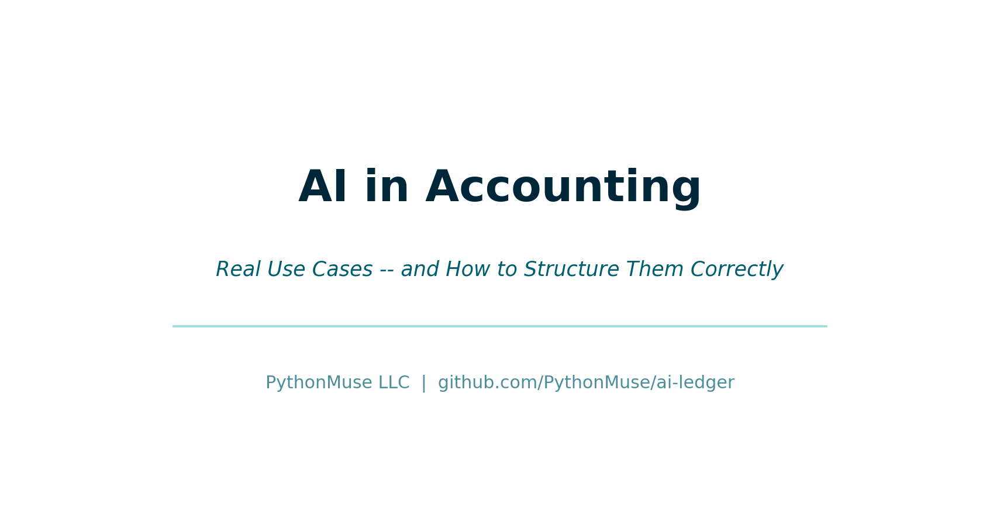
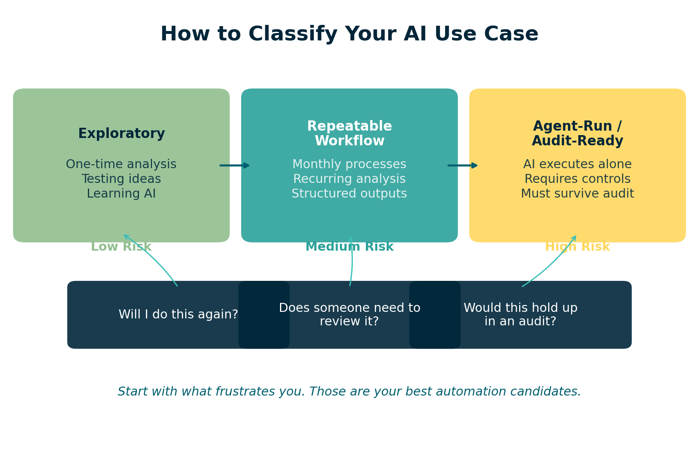
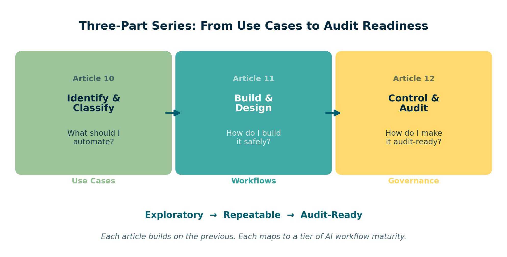

# AI in Accounting: Real Use Cases -- and How to Structure Them Correctly

*The gap between using AI and trusting AI starts with one question*

---

**By Svetlana Toohey**
*Published March 2026*

---

## The Question That Changed How I Work

Every time a new task hits my desk, I now pause and ask:

**Is this something I should do... or something I should design once and never do again?**

That one question changed everything for me.

Because AI in accounting is not about doing things faster. It is about deciding what deserves to become a system.

---

## Where AI Actually Shows Up in Accounting

Let me make this real. These are the areas where I consistently see value:

### Reconciliations

- Bank reconciliations
- AR tie-outs
- Payroll validation

I remember my first attempt at automating a reconciliation. I walked away to grab coffee and came back to a blank screen. No results. No logs. No idea what happened.

That is when I realized: **AI without structure is just noise.**

### Variance Analysis

- Actual vs Budget
- Actual vs Prior Year
- Margin analysis

These are areas where AI excels -- pattern recognition across large datasets, flagging anomalies, and producing consistent narratives month after month. But only if you tell it exactly what to compare and how to format the output.

### Ad Hoc Analysis

- "Why did this expense spike?"
- "Which clients are less profitable this quarter?"
- "What changed between Q3 and Q4?"

These are the questions that land on your desk without warning. AI can help answer them quickly -- but the workflow is very different from a recurring process.

### Data Preparation

- Cleaning exports from ERP systems
- Mapping accounts across entities
- Standardizing formats before import

This is often the most time-consuming part of any analysis. And it is exactly the kind of work AI handles well -- as long as you define the rules clearly.

---

## This Might Feel Like a Lot -- It Is Not

At this point, it can feel overwhelming. Reconciliations. Automation. Workflows.

But here is what most people miss:

**You are not building this alone.**

With tools like Claude, you can describe what you want in plain English and get a structured plan in minutes.

- AI drafts the approach
- AI suggests steps
- AI organizes logic

You review and approve.

If you have followed the earlier articles in this series -- from [getting tools installed](../03-getting-the-right-tools-installed/) to [working with Claude in VS Code](../01-ai-copilot-for-accounting/) -- you already have what you need to start.

---

## Not All AI Work Should Be Built the Same

This is where most teams go wrong. They treat every task the same.

Instead, I classify work into three levels:

### Exploratory

- One-time analysis
- Testing ideas
- Learning AI capabilities

This is where innovation happens. You are prototyping, experimenting, seeing what is possible. The structure is light -- maybe a single prompt and a CSV file. And that is fine.

**But exploratory work should never stay in production.**

### Repeatable Workflow

- Monthly processes
- Recurring analysis
- Structured outputs

Once you run something twice, it is no longer analysis. It is a system. And systems require structure: defined inputs, documented steps, and consistent outputs.

This is where the [PythonMuse AI Accounting Framework](https://github.com/PythonMuse/pythonmuse-ai-accounting-framework/tree/main) becomes your guide. From [data structure](https://github.com/PythonMuse/pythonmuse-ai-accounting-framework/tree/main/09-data-structure) to [project hygiene](https://github.com/PythonMuse/pythonmuse-ai-accounting-framework/tree/main/08-project-hygiene), each module addresses a specific piece of making workflows reliable.

### Agent-Run / Audit-Ready

- AI executes independently
- Requires controls and governance
- Must hold up under audit

This is the highest tier. The workflow runs without you watching it. That means it needs hooks, validation, logging, and alignment with frameworks like COSO.

The [AI Governance for Accounting and Finance](https://github.com/PythonMuse/accounting_and_finance-ai-governance) repository provides the templates, risk assessments, and control matrices you need at this level.

---

## How to Decide Where Your Task Belongs

Ask yourself four questions:

| Question | If Yes... |
|----------|-----------|
| Will I do this again? | It is at least a Repeatable Workflow |
| Does someone else need to review it? | Add documentation and structure |
| Would this need to hold up in an audit? | It needs to be Agent-Run / Audit-Ready |
| Would I trust AI to run this without me? | Only if controls are in place |

*Figure: Decision framework for classifying AI use cases in accounting.*

---

## Why Structure Matters

**Without structure:**

- Outputs are inconsistent
- Work cannot be reused
- There is no audit trail
- You solve the same problem twice

**With structure:**

- Work becomes repeatable
- AI becomes reliable
- Results become defensible
- You design once and trust going forward

This is not theoretical. In [Reproducible Accounting](../05-reproducible-accounting/), we explored why reproducibility is the foundation. In [Safe AI Data Workflows](../06-safe-ai-data-workflows/), we covered how to protect sensitive data. In [AI Governance for Controllers](../07-ai-governance-for-controllers/), we looked at what oversight looks like.

These three new articles bring it all together -- from use case identification to execution to audit readiness.

---

## Start With What Frustrates You

The tasks that:

- feel repetitive
- require too many manual steps
- make you double-check everything

Those are your best automation candidates.

I challenge myself every time a new or repetitive task comes in: **What can I do with AI? And should I make it a repeatable workflow?**

That habit alone changed my relationship with accounting work.

---

## Where This Is Going

This article is Part 1 of a three-part series:

| Part | Article | Focus |
|------|---------|-------|
| **1** | **This article** | Use cases and how to classify them |
| 2 | [From One-Time Analysis to Repeatable Workflows](../11-one-time-to-repeatable-workflows/) | Designing safe, scalable AI workflows |
| 3 | [When to Trust AI to Run Your Accounting Workflows](../12-audit-ready-ai-workflows/) | Making workflows audit-ready with COSO |

*Figure: How the three articles in this series connect -- from identifying use cases to building repeatable workflows to achieving audit readiness.*

---

## Final Thought

I no longer think in terms of tasks.

I think in terms of workflows I can design once -- and trust going forward.

The mistake is not experimenting with AI. The mistake is leaving experimental workflows in production.

---

*Related: [Your AI Co-Pilot for Accounting](../01-ai-copilot-for-accounting/) | [Reproducible Accounting](../05-reproducible-accounting/) | [Safe AI Data Workflows](../06-safe-ai-data-workflows/) | [AI Accounting Framework](https://github.com/PythonMuse/pythonmuse-ai-accounting-framework/tree/main) | [AI Governance Repository](https://github.com/PythonMuse/accounting_and_finance-ai-governance)*
