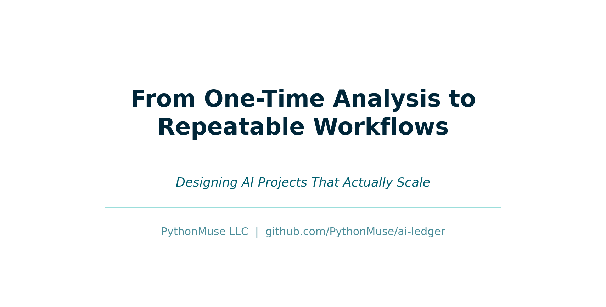
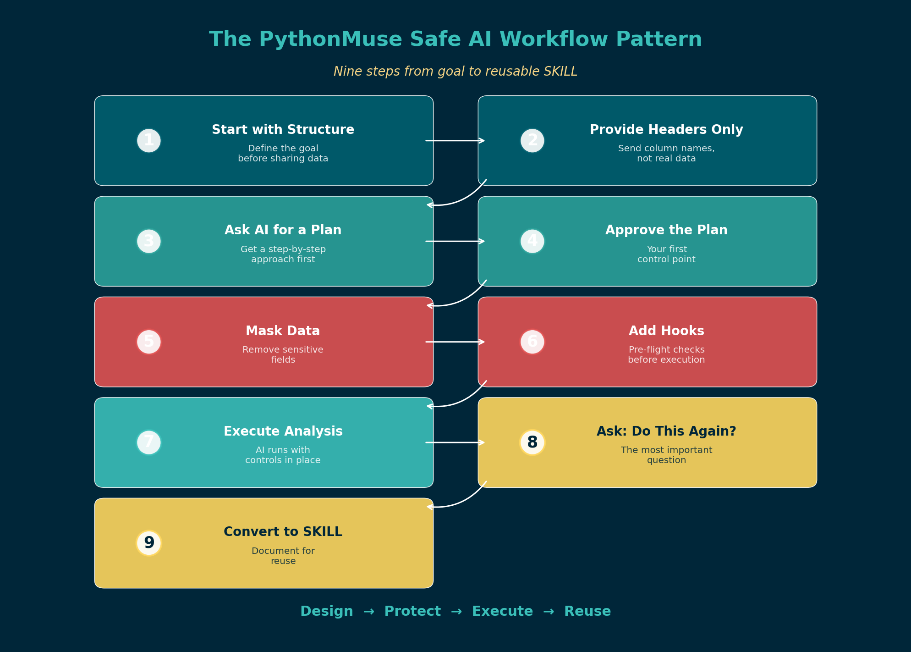

# From One-Time Analysis to Repeatable Workflows: Designing AI Projects That Actually Scale

*A practical guide to building AI workflows you can trust, reuse, and hand off*

---

**By Svetlana Toohey**
*Published March 2026*



---

## I Did Not Start With a Framework

I started by experimenting. Breaking things. Losing outputs. Running analyses I could not reproduce.

At one point, I ran a workflow, walked away, and came back with no idea what AI had done. No output file. No log. Just a blinking cursor.

That is when it clicked:

**If I cannot explain it, I cannot trust it. And if I cannot trust it, I cannot reuse it.**

If you have been following this series, you already know [why structure matters](../10-ai-use-cases-and-structure/) and how to classify your use cases. This article is about what happens next -- when you take a one-time analysis and turn it into something real.

---

## The Shift: From Task to System

The moment you run something twice, it is no longer analysis. It is a system.

And systems require structure.

This is the same principle that separates a quick Excel calculation from a workbook you hand off to a colleague. One is throwaway. The other needs to make sense to someone else -- and still work next month.

---

## The PythonMuse Safe AI Workflow Pattern

This is the approach I now follow every time. Nine steps. Each one exists because I learned the hard way what happens when you skip it.

### Step 1 -- Start With Structure, Not Data

Before sharing any data with AI, define the goal. What question are you answering? What output do you need? Who will review it?

This sounds obvious, but most people open a chat window and start pasting data immediately. I know because I did exactly that.

### Step 2 -- Provide Headers Only

Send AI the column headers from your dataset. Nothing else.

```
Date, Account, Amount, Department, Vendor
```

Then ask:

> "Based on these headers, how would you analyze this data?"

This gives AI enough context to be useful without exposing a single row of real data.

### Step 3 -- Ask AI for a Plan (Do Not Skip This)

This is the step most people skip. And it is the most important one.

> "Create a step-by-step plan for this analysis. Do not process any data yet."

AI drafts the approach. You review it. This single step replaces hours of manual thinking about methodology and structure.

The [Working With AI](https://github.com/PythonMuse/pythonmuse-ai-accounting-framework/tree/main/01-working-with-ai) module in the PythonMuse framework covers prompt iteration patterns in detail -- including examples for [reconciliations](https://github.com/PythonMuse/pythonmuse-ai-accounting-framework/tree/main/01-working-with-ai/examples/prompt-iteration-recon.md) and [variance analysis](https://github.com/PythonMuse/pythonmuse-ai-accounting-framework/tree/main/01-working-with-ai/examples/prompt-iteration-variance.md).

### Step 4 -- Approve the Plan

This is your first control point.

Read every step AI proposed. Does the logic make sense? Are the assumptions valid? Is anything missing?

This is no different from reviewing a staff accountant's workpaper before they execute it. The difference is that AI produces the draft in seconds instead of hours.

### Step 5 -- Mask Data Before Sending

This is non-negotiable for any workflow involving real financial data.

- Remove names and identifying information
- Replace sensitive fields with anonymized equivalents
- Aggregate where possible

The [Safe AI Data Workflows](../06-safe-ai-data-workflows/) article covers data masking tiers in detail. The [AI Permissions](https://github.com/PythonMuse/pythonmuse-ai-accounting-framework/tree/main/05-ai-permissions) module explains how to configure what AI can and cannot access.

### Step 6 -- Add Hooks (Critical)

Before anything is processed, set up validation gates:

- Confirm no raw/unmasked data is being passed to cloud-based AI
- Validate that the correct file is being used
- Check that the data structure matches expectations

Think of hooks as pre-flight checks. They run automatically before AI executes, catching problems before they become mistakes.

The [Hooks as Controls](https://github.com/PythonMuse/pythonmuse-ai-accounting-framework/tree/main/06-hooks-as-controls) module provides implementation patterns and examples.

### Step 7 -- Execute Analysis

Now -- and only now -- AI runs the analysis.

With the plan approved, data masked, and hooks in place, you can be confident that what AI produces will be consistent, traceable, and safe.

### Step 8 -- Ask the Most Important Question

After the analysis is complete, pause and ask:

**"Will I ever do this again?"**

If the answer is "maybe" or "yes," you are not done.

### Step 9 -- If Yes, Convert Into a SKILL

Document everything:

| Element | What to Record |
|---------|---------------|
| **Inputs** | What files, data sources, and formats are needed |
| **Outputs** | What the workflow produces and where it is saved |
| **Steps** | The exact sequence, including prompts used |
| **Assumptions** | What must be true for this workflow to work |
| **Controls** | What hooks and validations are in place |

The [Skills, Agents, and Models](https://github.com/PythonMuse/pythonmuse-ai-accounting-framework/tree/main/13-skills-agents-models) module explains how to structure a SKILL file that AI can execute consistently.



*Figure: The PythonMuse nine-step safe AI workflow pattern -- from goal definition to reusable SKILL.*

---

## This Is Easier Than It Sounds

At first, nine steps sounds like a lot of process.

But in reality, AI helps you design all of this in minutes:

- It drafts the plan
- It suggests controls
- It structures outputs
- It writes the SKILL documentation

**You guide and refine.** That is the accountant's role -- not building, but reviewing and approving.

If you have been through [How Accountants Learn AI](../09-how-accountants-learn-ai/), you already know the learning pattern: start simple, build habits, then formalize what works.

---

## A Real Example: Monthly Variance Analysis

Let me walk through how this plays out for a common use case.

**The task:** Every month, compare actual expenses to budget by department and explain significant variances.

**Without structure:** Open Excel, manually pull numbers, write explanations, email the file. Next month, start from scratch.

**With the PythonMuse pattern:**

1. **Goal:** Monthly variance report by department, flagging items over 10% or $5,000
2. **Headers sent to AI:** `Department, Account, Budget, Actual, Prior_Year`
3. **AI plan:** Calculate variances, flag thresholds, generate narratives for each flagged item
4. **Review and approve:** Confirm threshold logic and narrative format
5. **Mask data:** Use department codes instead of names, anonymize vendor details
6. **Hooks:** Validate file has current month dates, confirm all departments present
7. **Execute:** AI runs analysis, produces formatted output
8. **Reuse question:** Yes -- this runs every month
9. **SKILL created:** Documented with inputs, outputs, prompts, and thresholds

The first time takes 30 minutes. Every month after that takes 5.

---

## The Biggest Mistake I Made

Solving the same problem twice.

I would run an analysis, get the result, move on. Then next month, I would rebuild it from memory -- slightly different each time. Slightly less reliable.

Now, every time I complete a task, I ask: **Should this become a reusable workflow?**

And if the answer is yes, I invest the extra ten minutes to document it as a SKILL. Not because I enjoy documentation -- but because future me will thank present me.

---

## Folder Structure for Repeatable Workflows

When a workflow becomes repeatable, it deserves a project structure. Here is what I use:

```
monthly-variance-analysis/
  CLAUDE.md           # Project instructions for AI
  plan.md             # Workflow steps and methodology
  status_update.md    # Execution log
  data/
    raw/              # Original exports (never modified)
    masked/           # Anonymized versions for AI
  outputs/            # Analysis results
  skills/
    variance-report/
      SKILL.md        # Reusable workflow definition
```

This mirrors the [Project Hygiene](https://github.com/PythonMuse/pythonmuse-ai-accounting-framework/tree/main/08-project-hygiene) recommendations and the [external memory pattern](../08-why-claude-forgets/) we covered earlier.

---

## When Not to Formalize

Not everything needs to become a SKILL. Quick, one-time explorations are fine as throwaway work. The key is being honest about which category your task falls into:

| Signal | Classification |
|--------|---------------|
| You have done this before | Repeatable -- formalize it |
| Someone else might need to do this | Repeatable -- formalize it |
| It was a one-off question from leadership | Exploratory -- keep it simple |
| It supports a monthly close process | Repeatable -- formalize it |
| You are learning a new technique | Exploratory -- keep it simple |

---

## What Is Next

In the [final article of this series](../12-audit-ready-ai-workflows/), we take this one step further:

- What happens when AI runs without you
- How to make workflows hold up under audit
- How to align AI workflows with COSO and governance expectations

That is where the [AI Governance for Accounting and Finance](https://github.com/PythonMuse/accounting_and_finance-ai-governance) repository becomes essential -- providing risk assessments, control matrices, and governance templates designed specifically for AI-powered accounting workflows.

---

## Final Thought

The goal is not to work faster.

The goal is to stop doing the same thinking twice.

---

*Related: [The Power of Skills and Agents](../17-skills-and-agents-for-accountants/) | [AI Use Cases and How to Structure Them](../10-ai-use-cases-and-structure/) | [When to Trust AI to Run Your Accounting Workflows](../12-audit-ready-ai-workflows/) | [Safe AI Data Workflows](../06-safe-ai-data-workflows/) | [AI Accounting Framework](https://github.com/PythonMuse/pythonmuse-ai-accounting-framework/tree/main) | [AI Governance Repository](https://github.com/PythonMuse/accounting_and_finance-ai-governance)*
