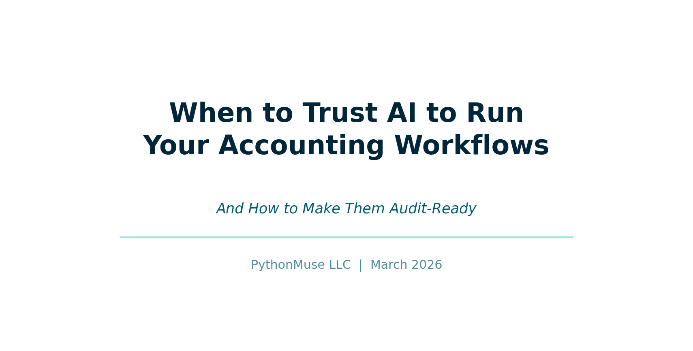
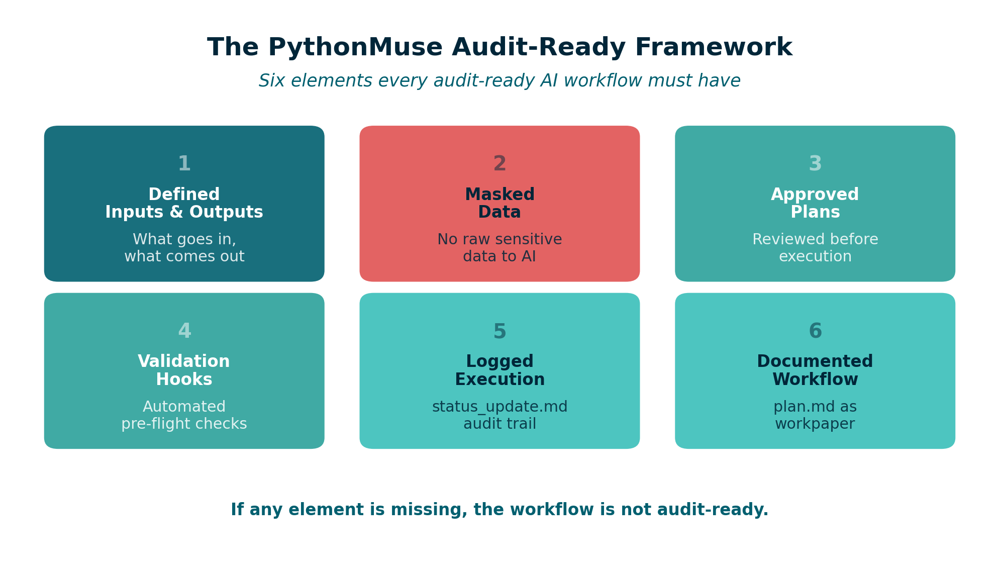
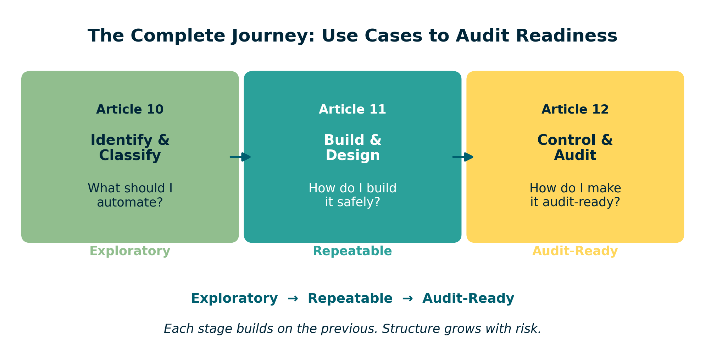

# When to Trust AI to Run Your Accounting Workflows (And How to Make Them Audit-Ready)

*COSO meets AI -- a practical framework for accounting and finance professionals*

---

**By Svetlana Toohey**
*Published March 2026*



---

## The Coffee Test

I once ran an AI workflow, stepped away for coffee, and expected everything to be done when I came back.

Instead, I came back to nothing.

No output. No explanation. No record of what happened.

That moment changed how I think about AI. Not because AI failed -- but because I had no way to know what it did.

---

## The Real Question Is Not "Can AI Do This?"

It is:

**Can I trust this?**

In the [first article of this series](../10-ai-use-cases-and-structure/), we covered how to identify and classify AI use cases. In the [second article](../11-one-time-to-repeatable-workflows/), we walked through the nine-step pattern for turning one-time analysis into repeatable workflows.

This article is about the highest tier: workflows that run independently, produce evidence, and must hold up under audit.

---

## When Trust Becomes Critical

This matters most for:

- **Reconciliations** that support the financial close
- **Variance analyses** used in management reporting
- **Any output** supporting financial statements or audit requests

These are not exploratory tasks. These are workflows where the output carries weight -- where someone else will rely on what AI produced and ask: *"How was this prepared?"*

---

## What Changes at This Level

When AI runs without you watching it, the risk profile shifts:

| Area | Risk |
|------|------|
| **Data** | Exposure of sensitive information |
| **Logic** | Incorrect assumptions applied silently |
| **Output** | No traceability to source data |
| **Audit** | No evidence of what was done or why |

Every one of these risks is manageable. But only if you build the controls before you press "run."

---

## The PythonMuse Audit-Ready Framework

To trust AI at this level, you need six elements in place. No exceptions.

### 1. Defined Inputs and Outputs

Every workflow must clearly state:
- What data goes in (source, format, date range)
- What comes out (report, file, summary)
- Where outputs are saved

### 2. Masked Data

No raw sensitive data should reach cloud-based AI. The masking patterns from [Safe AI Data Workflows](../06-safe-ai-data-workflows/) and the [AI Permissions](https://github.com/PythonMuse/pythonmuse-ai-accounting-framework/tree/main/05-ai-permissions) module apply directly here.

### 3. Approved Plans

The workflow logic must be reviewed and approved before execution. This is Step 3 and Step 4 from the [nine-step pattern](../11-one-time-to-repeatable-workflows/) -- and at this tier, it is not optional.

### 4. Validation Hooks

Automated checks that run before and during execution:
- Data structure validation
- Masking confirmation
- Output completeness checks

The [Hooks as Controls](https://github.com/PythonMuse/pythonmuse-ai-accounting-framework/tree/main/06-hooks-as-controls) module provides implementation templates.

### 5. Logged Execution

Every run produces a `status_update.md` that records:
- When the workflow ran
- What inputs were used
- What outputs were produced
- Any exceptions or anomalies

This is your audit trail. The [Project Hygiene](https://github.com/PythonMuse/pythonmuse-ai-accounting-framework/tree/main/08-project-hygiene) module includes [status update templates](https://github.com/PythonMuse/pythonmuse-ai-accounting-framework/tree/main/08-project-hygiene/templates/status-update-template.md).

### 6. Documented Workflow

A `plan.md` file that describes the methodology, assumptions, and control logic. This is the workpaper equivalent -- the document that explains *how* and *why*, not just *what*.



*Figure: The six elements of the PythonMuse Audit-Ready Framework.*

---

## Where COSO Comes In

As we covered in [AI Governance in Accounting](../04-ai-governance-in-accounting/), the COSO framework provides the standard for what good internal controls look like. What it does not provide is specific guidance for AI workflows.

That is the gap PythonMuse fills.

Here is how COSO's five components translate into AI workflow controls:

| COSO Component | What It Means | PythonMuse Implementation |
|----------------|--------------|--------------------------|
| **Control Environment** | Who owns AI usage and sets expectations | CLAUDE.md project instructions, defined roles |
| **Risk Assessment** | What can go wrong with this workflow | Data classification, [risk assessment templates](https://github.com/PythonMuse/accounting_and_finance-ai-governance/tree/main/assessments/templates/risk-template.md) |
| **Control Activities** | Guardrails that prevent errors | Masking, hooks, approval gates, [control matrix](https://github.com/PythonMuse/accounting_and_finance-ai-governance/tree/main/docs/control-matrix.md) |
| **Information & Communication** | Documentation and transparency | plan.md, SKILL.md, output files |
| **Monitoring Activities** | Ongoing review and validation | status_update.md, periodic review, [review and signoff](https://github.com/PythonMuse/accounting_and_finance-ai-governance/tree/main/docs/review-and-signoff.md) |

### The PythonMuse Difference

**COSO tells you what. PythonMuse shows you how.**

The [AI Governance for Accounting and Finance](https://github.com/PythonMuse/accounting_and_finance-ai-governance) repository translates each COSO component into actionable templates:

- [AI Policy](https://github.com/PythonMuse/accounting_and_finance-ai-governance/tree/main/docs/ai-policy.md) -- organizational AI usage guidelines
- [Approved Use Cases](https://github.com/PythonMuse/accounting_and_finance-ai-governance/tree/main/docs/approved-use-cases.md) -- registry of sanctioned AI workflows
- [Data Classification](https://github.com/PythonMuse/accounting_and_finance-ai-governance/tree/main/docs/data-classification.md) -- how to classify and protect data
- [Change Management](https://github.com/PythonMuse/accounting_and_finance-ai-governance/tree/main/docs/change-management.md) -- how workflow changes are reviewed
- [Risk Methodology](https://github.com/PythonMuse/accounting_and_finance-ai-governance/tree/main/docs/risk-methodology.md) -- how to assess and score risks
- [Controller Governance Toolkit](https://github.com/PythonMuse/accounting_and_finance-ai-governance/tree/main/toolkit/controller-ai-governance-toolkit.md) -- comprehensive implementation guide

---

## Example: Audit-Ready Bank Reconciliation

Let me show how all of this comes together for one of the most common accounting workflows.

| Element | Implementation |
|---------|---------------|
| **Input** | Bank statement (CSV) + General Ledger export (CSV) |
| **Process** | AI-powered matching logic with tolerance rules |
| **Output** | Reconciliation file with matched/unmatched items |
| **Masking** | Account numbers truncated, vendor names anonymized |
| **Hooks** | Validate file dates match, confirm all accounts present |
| **Log** | status_update.md records run date, match rate, exceptions |
| **Plan** | plan.md documents matching methodology and thresholds |
| **SKILL** | Documented in SKILL.md for monthly reuse |

The [sample bank reconciliation](https://github.com/PythonMuse/accounting_and_finance-ai-governance/tree/main/examples/sample-bank-reconciliation.md) in the governance repository provides a working example, and the [bank reconciliation risk assessment](https://github.com/PythonMuse/accounting_and_finance-ai-governance/tree/main/assessments/UC-001-bank-rec-risk.md) shows how to document the control structure.

**This is no longer just analysis. It is audit evidence.**

---

## The Canary Check

One additional control worth mentioning: the canary test.

Before any workflow runs, include a simple check that confirms your environment is configured correctly. This is a concept borrowed from security testing -- a harmless trigger that validates everything is working as expected.

The [Canary Concept](https://github.com/PythonMuse/pythonmuse-ai-accounting-framework/tree/main/07-canary-concept) module explains how to set this up in any project.

Think of it as testing the fire alarm before you need it.

---

## This Is Not About Replacing Accountants

It is about becoming system designers.

The accounting profession has always been about judgment, accuracy, and accountability. AI does not change that. AI changes *how* we deliver it.

When you build an audit-ready workflow:
- You are still the one defining the logic
- You are still the one reviewing the output
- You are still the one who signs off

But you are spending your time on judgment calls instead of data manipulation.

---

## How All Three Articles Connect

This series was designed as a progression:

```
Article 10: What should I automate?
     ↓
Article 11: How do I build it safely?
     ↓
Article 12: How do I make it audit-ready?
```



*Figure: The three-article progression -- from identifying use cases to building workflows to achieving audit readiness.*

Each article builds on the previous one. And each one maps to a tier from the [use case classification framework](../10-ai-use-cases-and-structure/):

| Tier | Article | Focus |
|------|---------|-------|
| Exploratory | [Article 10](../10-ai-use-cases-and-structure/) | Identifying and classifying use cases |
| Repeatable | [Article 11](../11-one-time-to-repeatable-workflows/) | Building safe, scalable workflows |
| Audit-Ready | **Article 12 (this article)** | Governance, controls, and COSO alignment |

---

## Where to Go From Here

If you are ready to start building:

1. **Review your current workflows** -- Which ones are still exploratory? Which should be repeatable?
2. **Pick one recurring process** -- Start with something manageable, like a monthly variance report
3. **Follow the nine-step pattern** from [Article 11](../11-one-time-to-repeatable-workflows/)
4. **Apply the audit-ready framework** from this article when the workflow supports financial reporting
5. **Use the governance templates** from the [AI Governance Repository](https://github.com/PythonMuse/accounting_and_finance-ai-governance) to document controls
6. **Explore the full framework** at the [PythonMuse AI Accounting Framework](https://github.com/PythonMuse/pythonmuse-ai-accounting-framework/tree/main)

And if you want to contribute -- share your use cases, your skills, your lessons learned. Visit the [GitHub community](https://github.com/PythonMuse/accounting_and_finance-ai-governance) and help build what structured AI training for accounting and finance professionals should look like.

---

## Final Thought

Now, every workflow I build, I ask:

**Would I trust this to run while I grab coffee?**

If the answer is no, I do not automate it yet. I structure it first.

Because the goal was never to work faster. The goal was to build systems I can stand behind.

---

*Related: [The Power of Skills and Agents](../17-skills-and-agents-for-accountants/) | [AI Use Cases and How to Structure Them](../10-ai-use-cases-and-structure/) | [From One-Time Analysis to Repeatable Workflows](../11-one-time-to-repeatable-workflows/) | [AI Governance in Accounting](../04-ai-governance-in-accounting/) | [AI Governance for Controllers](../07-ai-governance-for-controllers/) | [AI Accounting Framework](https://github.com/PythonMuse/pythonmuse-ai-accounting-framework/tree/main) | [AI Governance Repository](https://github.com/PythonMuse/accounting_and_finance-ai-governance)*
