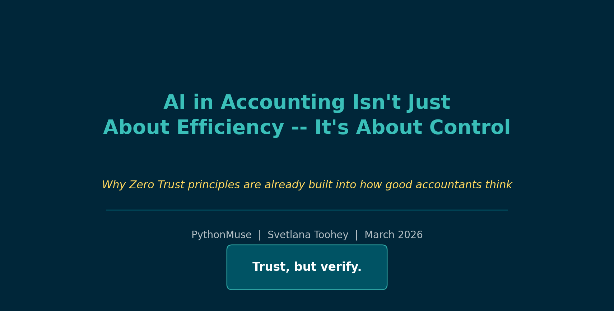
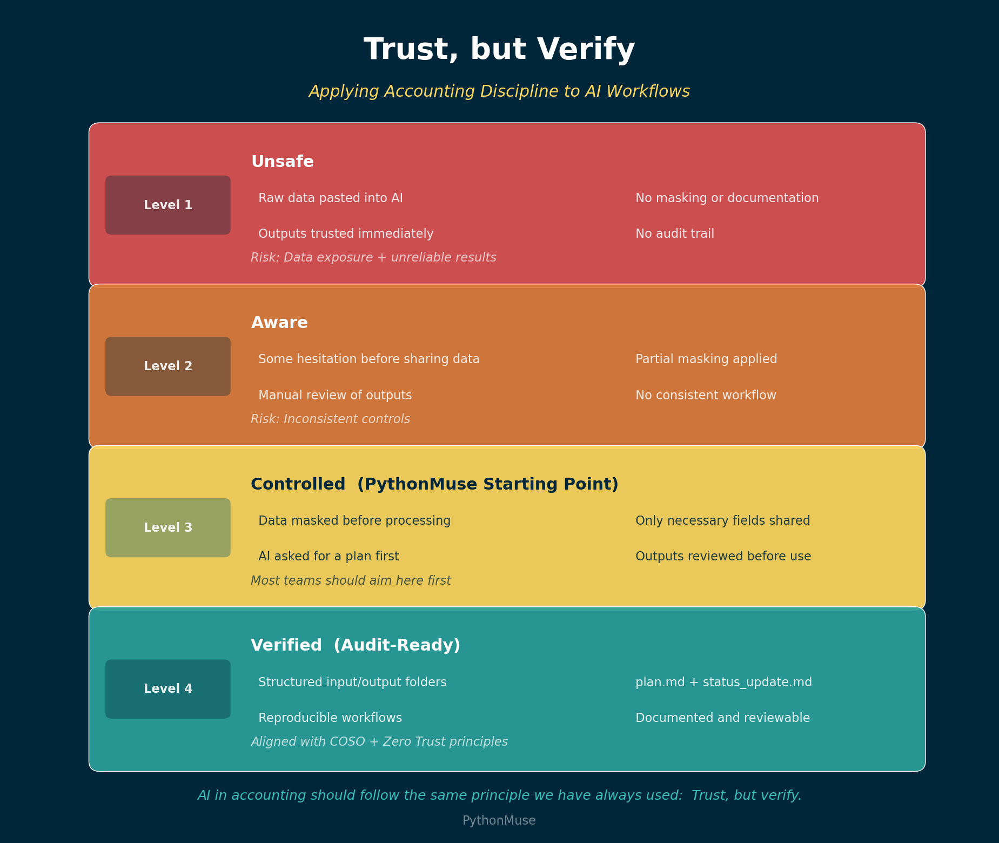
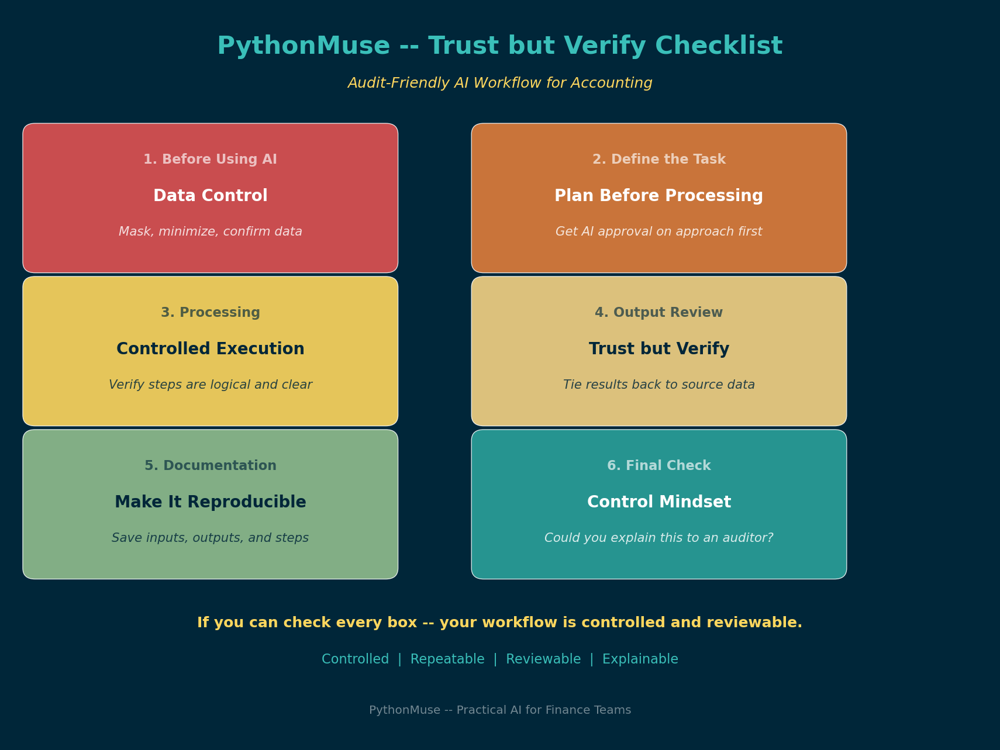

# AI in Accounting Isn't Just About Efficiency -- It's About Control

*Why Zero Trust principles are already built into how good accountants think*

---

**By Svetlana Toohey**
*Published March 2026*

---

## The Moment I Hesitated

A few months ago, I caught myself pausing before pasting a dataset into an AI tool.

Not because I didn't trust the technology.

But because I didn't fully understand where the data would go -- and what would happen to it after.

At the time, it felt like I might be overthinking it.

Turns out, I wasn't.

---

## Why This Matters Now

Microsoft recently released guidance on something called Zero Trust for AI.

The concept is simple: don't assume AI is safe by default. Verify everything.

If you have worked in accounting, this should sound familiar.

From day one, we are taught: trust, but verify.

We do not:

- trust numbers without reconciliation
- approve entries without support
- rely on outputs without review

And yet, with AI, many teams are doing exactly that.

---

## This Is Not Just One Company's Perspective

Microsoft is formalizing Zero Trust for AI:
[New Tools and Guidance: Announcing Zero Trust for AI](https://www.microsoft.com/en-us/security/blog/2026/03/19/new-tools-and-guidance-announcing-zero-trust-for-ai/)

OWASP is publishing the LLM Top 10:
[OWASP Top 10 for Large Language Model Applications](https://owasp.org/www-project-top-10-for-large-language-model-applications/)

Both are reinforcing the same idea: AI introduces real risks -- especially when it interacts with your data.

I am not a cybersecurity expert, and I do not design enterprise security architectures.

But I do think finance teams should be aware of this. Because we are responsible for:

- financial data
- reporting accuracy
- auditability

---

## What Zero Trust for AI Means for Accounting

You do not need to learn security jargon. Here is how it translates:

| Security Concept | Accounting Reality |
|------------------|-------------------|
| Never trust input | Do not paste raw data into AI |
| Least privilege access | Share only what is necessary |
| Monitor outputs | Review before using results |
| Continuous verification | Re-run, document, validate |

This is not new. It is the same discipline we already apply -- just in a different tool.

---

## What OWASP Risks Look Like in Real Accounting Work

Instead of listing technical terms, here is how these risks show up in accounting workflows:

- A file you upload contains hidden instructions -- AI behaves unexpectedly
- You paste a dataset with sensitive fields -- data exposure risk
- AI generates a clean-looking analysis -- but the logic is wrong
- An agent runs a process -- but no one can explain what happened
- Outputs are used -- without documentation or review

If that sounds uncomfortable, it should.

Because these are the same types of issues we control for every day in accounting.

---

## What I Actually Do in Practice

I am not designing enterprise security systems.

But I am applying controls to how I use AI.

Here is what that looks like:

- I never send raw company or client data into AI tools
- I mask names, amounts, and identifiers first
- I often start with just column headers
- I ask AI to propose a plan before processing
- I review outputs before trusting them

At the time, this felt like common sense. Now I see it aligns directly with broader frameworks.

The data masking process I use is covered in detail in [Safe AI Data Workflows](../06-safe-ai-data-workflows/), and the column-headers-only approach appears in the nine-step workflow pattern in [From One-Time Analysis to Repeatable Workflows](../11-one-time-to-repeatable-workflows/).

---

## Real Accounting Workflows Where This Matters

This shows up in everyday work.

**Bank Reconciliations**
AI can help match transactions -- but you still need:
- controlled inputs
- traceable outputs
- documented differences

**Payroll Testing (401k match, for example)**
AI can analyze expected vs. actual -- but:
- data must be masked
- logic must be reviewed
- results must be reproducible

**Revenue and Margin Analysis**
AI can summarize trends quickly -- but:
- source data must be controlled
- assumptions must be validated
- outputs must tie back to source

**Audit Requests and Support Schedules**
AI can help compile support -- but:
- documentation must be clear
- steps must be explainable
- files must be retained

In all of these: AI is assisting, not replacing, the control environment.

---

## The Moment It Clicked

The first time I built an AI-assisted workflow, I was excited.

I had an agent set up to reconcile 401(k) match calculations. I ran it and went to grab coffee.

When I came back: nothing.

No summary. No explanation. No output trail.

That was not just frustrating. That was a control failure.

I described this moment in [When to Trust AI to Run Your Accounting Workflows](../12-audit-ready-ai-workflows/). The fix was not a technical solution -- it was a documentation and structure solution.

---

## How I Fixed It

Now every workflow I build includes:

- `plan.md` -- what AI is supposed to do
- `status_update.md` -- what actually happened
- structured input and output folders
- saved outputs for review

When I come back, I do not guess. I review.

What was done? Where is it saved? Any issues?

That is not just good workflow design. That is trust, but verify.

---

## Before You Assume Enterprise AI Means Safe

One thing I want to say clearly: using an enterprise AI tool does not automatically mean your data is safe.

Even in enterprise environments:

- data can still be shared incorrectly
- prompts can include too much
- outputs can still be wrong
- workflows can still lack controls

Security is not just the tool. It is how you use it.

---

## Where PythonMuse Fits In

I am not replacing frameworks like:

- [COSO Generative AI Guidance](https://www.coso.org/generative-ai) -- defines controls and governance
- [Microsoft Zero Trust for AI](https://www.microsoft.com/en-us/security/blog/2026/03/19/new-tools-and-guidance-announcing-zero-trust-for-ai/) -- defines Zero Trust mindset
- [OWASP LLM Top 10](https://owasp.org/www-project-top-10-for-large-language-model-applications/) -- defines risks

What I am building with PythonMuse is a bridge between theory and real accounting work.

COSO defines controls. Microsoft defines mindset. OWASP defines risks. PythonMuse shows how to actually work this way.

And it is not as hard as it feels.

You do not need a full IT transformation, new systems, or complex architecture. You need a few well-designed prompts and a structured workflow.

Once you set it up, it becomes repeatable, reviewable, and scalable -- just like Excel templates, reconciliation workpapers, and close checklists.

*Figure: The four-level Trust but Verify framework -- from ad hoc AI use to audit-ready workflows.*

---

## The Four Levels of AI Control in Accounting

Most teams are somewhere on this spectrum. Here is a framework for thinking about where you are and where to aim.

| Level | Description | Risk |
|-------|-------------|------|
| **Level 1 -- Unsafe** | Raw data pasted into AI, no masking, no documentation, outputs trusted immediately | Data exposure and unreliable results |
| **Level 2 -- Aware** | Some hesitation before sharing, partial masking, manual review, no consistent structure | Inconsistent controls |
| **Level 3 -- Controlled** | Data masked before use, only necessary fields shared, AI asked for a plan first, outputs reviewed | Most teams should aim here first |
| **Level 4 -- Verified** | Structured folders, `plan.md` and `status_update.md`, reproducible workflows, documented and reviewable | Aligned with COSO and Zero Trust principles |

Level 3 is the PythonMuse starting point. Level 4 is what audit-ready looks like.

The path from Level 3 to Level 4 is covered in [When to Trust AI to Run Your Accounting Workflows](../12-audit-ready-ai-workflows/).

---

## The PythonMuse Trust but Verify Checklist

*Figure: Six-section checklist for audit-friendly AI workflows in accounting.*

Use this before, during, and after working with AI on any accounting task. If you can check every box, your workflow is controlled and reviewable.

The full checklist is available as a standalone reference you can print, attach to a workpaper, or paste into your workflow documentation:

**[Trust but Verify Checklist](../../examples/trust-but-verify-checklist/)**

| Section | Focus | Gate |
|---------|-------|------|
| 1. Before Using AI | Data Control | Stop if data is not masked |
| 2. Define the Task | Plan Before Processing | AI proposes, you approve |
| 3. Processing | Controlled Execution | You can explain every step |
| 4. Output Review | Trust but Verify | Results tie to source |
| 5. Documentation | Make It Reproducible | Someone else could repeat this |
| 6. Final Check | Control Mindset | You could explain it to an auditor |

---

## Where to Go From Here

**To get the frameworks:**

- [Microsoft Zero Trust for AI](https://www.microsoft.com/en-us/security/blog/2026/03/19/new-tools-and-guidance-announcing-zero-trust-for-ai/) -- Free
- [OWASP LLM Top 10](https://owasp.org/www-project-top-10-for-large-language-model-applications/) -- Free
- [COSO Generative AI Guidance](https://www.coso.org/generative-ai) -- Paid

**To build the workflows covered in this article:**

1. Start with [Safe AI Data Workflows](../06-safe-ai-data-workflows/) to implement data masking
2. Apply the nine-step pattern from [From One-Time Analysis to Repeatable Workflows](../11-one-time-to-repeatable-workflows/)
3. Add audit-ready controls from [When to Trust AI to Run Your Accounting Workflows](../12-audit-ready-ai-workflows/)
4. Set up your governance structure using the [AI Governance for Controllers](../07-ai-governance-for-controllers/) framework

---

## Final Thought

If you have been cautious about using AI, you are not behind.

You are thinking exactly the way you were trained to think.

Trust, but verify.

And now, the rest of the world is starting to catch up.

---

*Related: [Safe AI Data Workflows](../06-safe-ai-data-workflows/) | [From One-Time Analysis to Repeatable Workflows](../11-one-time-to-repeatable-workflows/) | [When to Trust AI to Run Your Accounting Workflows](../12-audit-ready-ai-workflows/) | [AI Governance for Controllers](../07-ai-governance-for-controllers/)*
