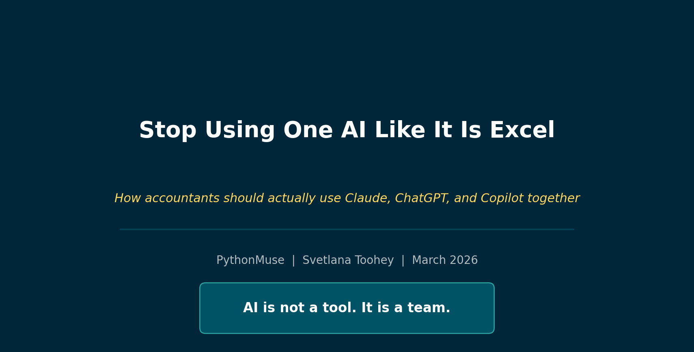
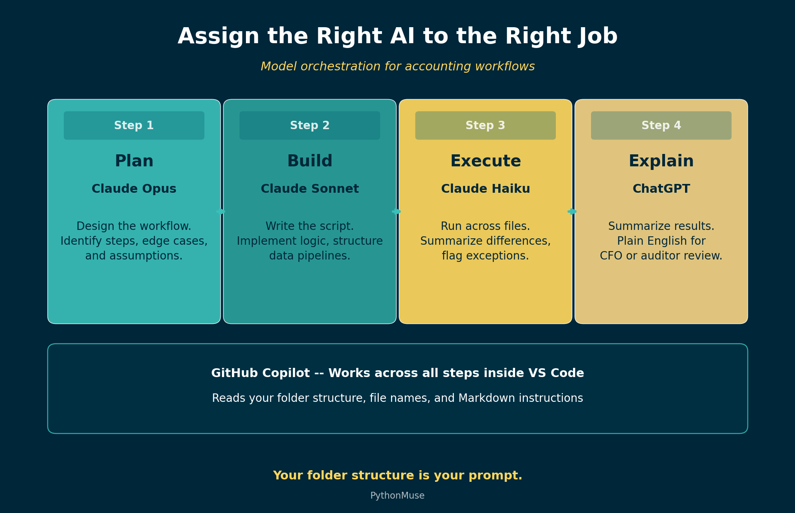

# Stop Using One AI Like It Is Excel

*How accountants should actually use Claude, ChatGPT, and Copilot together*

---

**By Svetlana Toohey**
*Published March 2026*



---

## A Quick Story

The first time I used AI for a real accounting workflow, I did what most of us do.

Opened a chat box. Pasted data. Asked it to "analyze."

Then I waited for magic.

What I got instead:

- A decent answer
- No structure
- No repeatability
- And definitely nothing I would want to show an auditor

That is when it clicked. I was not using AI wrong. I was thinking about it wrong.

---

## The Wrong Question

Most accountants are asking:

"Should I use ChatGPT or Claude?"

That is like asking: "Should I use Excel or email?"

They serve different purposes. And the right answer is almost always: use both, for different things.

If you have already explored how Claude's different interfaces work, [Ways to Use Claude](../02-ways-to-use-claude/) covers that in detail. This article goes further: how do you assign the right AI to the right job?

---

## The Right Mental Model

AI is not a tool. It is a team.

And just like your accounting team, not everyone does the same job -- and not everyone should.

When you assign a staff accountant to a task that requires a controller's judgment, things go wrong. The same principle applies to AI models. Each one has a role.

---

## Meet Your AI Team

### Claude Models -- Your Core Accounting Team

| Model | Accounting Analogy | Best For |
|-------|-------------------|----------|
| **Opus** | Technical accounting expert | Complex logic, edge cases, multi-step reasoning, planning |
| **Sonnet** | Senior accountant | Building workflows, writing scripts, implementation |
| **Haiku** | Staff accountant / automation | Fast execution, repeating established tasks, simple analysis |

**Opus** is the model you bring in when the problem requires deep thinking. A complicated revenue recognition question, a multi-entity consolidation with intercompany eliminations, or designing the architecture of a new workflow. It is slower and more expensive, but it gets the hard problems right.

**Sonnet** is your day-to-day workhorse. It writes Python scripts, builds reconciliation logic, structures data pipelines, and implements the plans that Opus designs. Most of the articles in this series were built with Sonnet.

**Haiku** is fast and lightweight. Once you have a script that works, Haiku can run it across files, summarize data, or handle routine analysis that does not require deep reasoning. Think of it as the model you use when the thinking is already done and you need execution.

For a deeper look at how Claude's interfaces work (web, IDE, and API), see [Ways to Use Claude](../02-ways-to-use-claude/).

### ChatGPT -- Your Whiteboard Partner

[ChatGPT](https://chatgpt.com) is best used for:

- Brainstorming ideas and approaches
- Explaining concepts in plain language
- Drafting summaries for non-technical stakeholders
- Quick research and first-pass analysis

Think of ChatGPT as the colleague you walk to the whiteboard with. You sketch ideas, talk through problems, and refine your thinking. But you would not hand it a live workbook and ask it to run your close.

ChatGPT is a starting point, not a production system.

### GitHub Copilot -- The One That Works Inside Your Files

[GitHub Copilot](https://github.com/features/copilot) is where things change.

Copilot is not just another chat tool. It lives inside [Visual Studio Code](https://code.visualstudio.com/). It reads your files. It understands your structure. It works inside your workflow.

If you have already set up VS Code using the guidance in [Getting the Right Tools Installed](../03-getting-the-right-tools-installed/), adding Copilot is the next step.

---

## How Copilot Actually Thinks

Most people treat Copilot like ChatGPT. That is a mistake.

Copilot prioritizes:

- Your folder structure
- Your file names
- Your existing code
- Your Markdown instructions (`plan.md`, `CLAUDE.md`, `status_update.md`)

This means the way you organize your project directly affects how well Copilot can help you. A messy folder with random file names gives Copilot nothing to work with. A structured project gives it everything.

**Your folder structure is your prompt.**

```
/project
  /data
    /raw
    /processed
  /src
  /outputs
  plan.md
  status_update.md
```

This is not just organization. This is how you teach AI how to work with you.

If you have read [Why Claude "Forgets"](../08-why-claude-forgets/), you already know why `plan.md` and `status_update.md` matter. Copilot uses these files the same way -- they become the context that makes AI useful across sessions.

---

## The GitHub Superpower Most People Miss

Here is where it gets powerful.

Instead of explaining your workflow every time, you can import it.

Inside VS Code, you can ask Copilot:

> "Pull the folder structure and workflow patterns from the PythonMuse Workflow Kit and set up my workspace."

And within seconds:

- Structure appears
- Patterns are inferred
- You are not starting from scratch

The [PythonMuse Workflow Kit](https://github.com/PythonMuse/pythonmuse-workflow-kit) is a ready-to-use project template on GitHub. It includes the folder structure, `CLAUDE.md` instructions, `plan.md` and `status_update.md` templates, and starter skills for bank reconciliation and margin analysis. Click "Use this template" on GitHub to create your own copy, or ask Copilot to import it.

The [PythonMuse AI Ledger](https://github.com/PythonMuse/ai-ledger) repository and the [AI Accounting Framework](https://github.com/PythonMuse/pythonmuse-ai-accounting-framework) are also public on GitHub. Copilot can find them, read them, and apply their patterns to your project.

You are not prompting anymore. You are deploying a system.

---

## Skills: The Next Layer

A "Skill" is simply a reusable workflow with instructions that AI can follow consistently.

Instead of writing this every time:

> "Compare bank to GL, find differences, save results..."

You create a Skill file:

```
/skills/reconciliation/SKILL.md
```

The Skill file tells AI exactly what to do, what data to expect, and where to save results. The [Skills, Agents, and Models](https://github.com/PythonMuse/pythonmuse-ai-accounting-framework/tree/main/13-skills-agents-models) module in the AI Accounting Framework explains how to structure these files.

Two ready-to-use examples are available now:

- [Bank Reconciliation Skill](../../examples/skill-bank-reconciliation/) -- match bank to GL, classify exceptions, produce audit-ready output
- [Margin Analysis Skill](../../examples/skill-margin-analysis/) -- gross margin by segment, period comparison, concentration risk flags

Copy either into your project, point AI at your data, and you have a repeatable workflow.

**How you use it today:**

> "Load the reconciliation skill from /skills/reconciliation and apply it to files in /data/raw. Follow plan.md and update status_update.md with results."

**Where this is heading:**

> "Use PythonMuse reconciliation skill."

And Copilot will find it, load it, and execute it.

This is the shift from [one-time analysis to repeatable workflows](../11-one-time-to-repeatable-workflows/) that we covered earlier -- but now with a distribution layer that makes your workflows portable.

---

## Model Orchestration: Assigning the Right AI to the Right Job

This is where everything clicks.



*Figure: A four-step accounting workflow with the right model assigned to each stage.*

### Example: Bank Reconciliation Workflow

| Step | Model | Task |
|------|-------|------|
| **1. Plan** | Opus | Design a reconciliation workflow comparing bank statement and GL. Identify key steps and edge cases. |
| **2. Build** | Sonnet | Write Python script to perform reconciliation using files in /data/raw. Save results to /outputs. |
| **3. Execute** | Haiku | Run reconciliation script across all files and summarize differences. |
| **4. Explain** | ChatGPT | Summarize reconciliation results in plain English for CFO review. |

You do not need a better AI. You need to assign the right AI to the right job.

This is the same principle behind the [three-tier classification](../10-ai-use-cases-and-structure/) we covered in Article 10 -- exploratory, repeatable, and audit-ready. The model you choose depends on which tier the task falls into.

---

## Bringing It All Together

This is exactly why PythonMuse focuses on:

- Structured folders -- so AI understands your project
- Markdown instructions -- so AI follows your plan
- Reusable skills -- so workflows are consistent
- GitHub as a distribution layer -- so you never start from scratch

The shift is not from one AI tool to another.

The shift is from prompts to systems.

---

## Try This: Start Here

1. Open [Visual Studio Code](https://code.visualstudio.com/)
2. Install [GitHub Copilot](https://github.com/features/copilot)
3. Clone the [PythonMuse Workflow Kit](https://github.com/PythonMuse/pythonmuse-workflow-kit) (or click "Use this template" on GitHub)
4. Ask Copilot to explain the structure
5. Edit `plan.md` for one workflow you do repeatedly
6. Run it

If you need help getting started with VS Code and Python, [Getting the Right Tools Installed](../03-getting-the-right-tools-installed/) walks through the full setup.

---

## Final Thought

You do not need to learn everything at once.

Start with one workflow you hate.

And ask: "What would this look like if it was repeatable?"

That is your first system.

---

*Related: [Ways to Use Claude](../02-ways-to-use-claude/) | [Getting the Right Tools Installed](../03-getting-the-right-tools-installed/) | [From One-Time Analysis to Repeatable Workflows](../11-one-time-to-repeatable-workflows/) | [AI Accounting Framework](https://github.com/PythonMuse/pythonmuse-ai-accounting-framework)*
