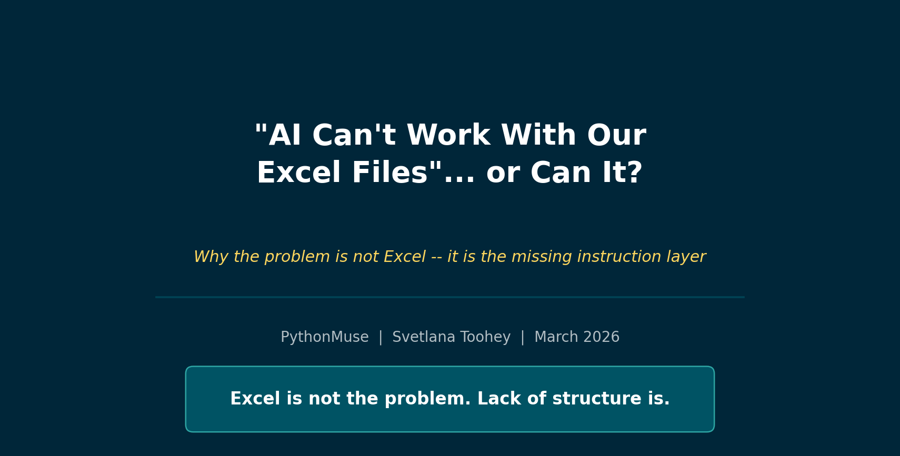
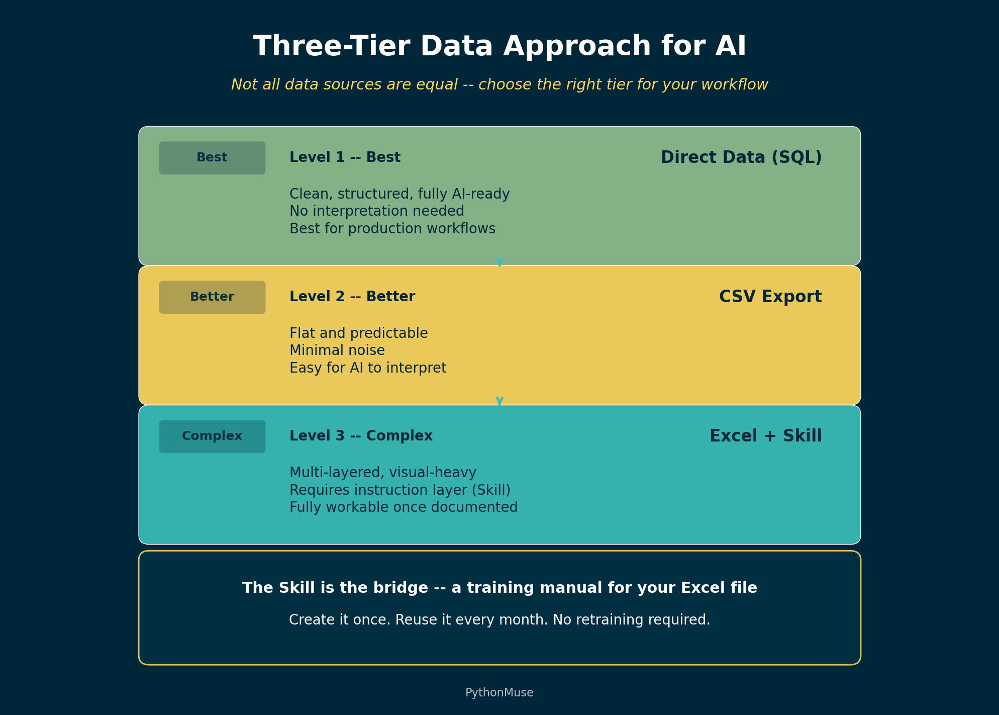

# "AI Can't Work With Our Excel Files"... or Can It?

*Why the problem is not Excel -- it is the missing instruction layer*

---

**By Svetlana Toohey**
*Published March 2026*



---

## The Objection

I recently heard something that made me pause.

A company told their accounting team:

> "AI and agents won't work for us -- our Excel files are too complex."

And to be fair, I get it.

Their workbooks likely look like most accounting files:

- 10+ tabs
- Pivot tables layered on pivot tables
- Hidden formulas
- Visual dashboards
- "Final_v3_UPDATED_use_this_one.xlsx"

From the outside, it does look like something AI would not be able to work with.

But here is the thing:

**That is not a limitation of AI. That is a missing instruction layer.**

---

## The Real Problem

AI struggles with Excel for the same reason a newly hired staff accountant would: it has not been taught how the file works.

If you handed a new hire a complex workbook and said "Go analyze this," they would struggle.

But if you spent 30 minutes explaining:

- Which tab is the source of truth
- Which tabs are just visuals
- Which pivots can be ignored
- How calculations are derived

They would figure it out quickly.

AI is the same way. It does not need simpler files. It needs better instructions.

---

## From Files to Instructions

Most teams are doing this:

> Upload Excel. "Analyze this."

What actually works:

> Upload Excel + "Here is how this file works."

That second piece is what changes everything. And in PythonMuse, we call it a **Skill**.

If you have followed the series, you have already seen Skills in action. [From One-Time Analysis to Repeatable Workflows](../11-one-time-to-repeatable-workflows/) introduced the Skill concept as documentation that makes AI workflows consistent and repeatable. [Article 14](../14-ai-team-for-accountants/) showed how Skills fit into model orchestration. This article applies the same idea to the one file type everyone said AI could not handle.

---

## The Three-Tier Data Approach

Not all data sources are equal. I recommend thinking about your data in three tiers:



*Figure: The three tiers of data readiness for AI -- from SQL (best) to Excel with a Skill (complex but workable).*

### Level 1 -- Best: Direct Data (SQL)

- Clean, structured, fully AI-ready
- No interpretation needed
- Best for recurring analysis and production workflows

### Level 2 -- Better: CSV

- Flat and predictable
- Minimal noise
- Easy for AI to interpret without extra instructions

### Level 3 -- Complex: Excel + Skill

- Multi-layered, visual-heavy, not self-explanatory
- Requires an instruction layer (a Skill) to guide AI
- Still fully workable once the Skill exists

Excel is not bad. It just needs context that CSV and SQL do not.

---

## What Is a "Skill" for Excel?

A Skill is documentation that teaches AI how your spreadsheet works.

Think of it as a **training manual for your Excel file**.

You create it once and reuse it every time that file (or its monthly refresh) needs analysis.

Here is a simplified example:

```markdown
# SKILL: Monthly Financial Workbook

## File Structure
- Raw_Data tab: source of truth (transaction-level detail)
- Pivot_Summary tab: validation reference only (do not rely on for analysis)
- Dashboard tab: visuals only (ignore for data extraction)

## Rules
- Always use the Raw_Data tab as the primary data source
- Recalculate totals from Raw_Data instead of trusting pivot summaries
- Ignore formatting, merged cells, and conditional highlighting
- Column A = Date, Column B = Department, Column D = Amount

## Supported Analyses
- Monthly variance (current vs prior month)
- Department spend comparison
- Trend analysis (trailing 6 months)
```

A full, production-ready example is available in the examples folder: [Excel Interpretation Skill](../../examples/skill-excel-interpretation/).

If you have already built a reconciliation or margin analysis Skill (see the [bank reconciliation](../../examples/skill-bank-reconciliation/) and [margin analysis](../../examples/skill-margin-analysis/) examples), this follows the exact same format. The only difference is that this Skill explains *the file itself*, not just the workflow.

---

## Demo: See the Difference

To make this real, I created a sample workbook that mirrors what you would see in a typical accounting department -- multiple tabs, pivot summaries, a dashboard, and transaction-level data mixed together.

Download the demo workbook: [monthly_financial_workbook.xlsx](./data/monthly_financial_workbook.xlsx)

### Without the Skill

Prompt:

> "Analyze this file and explain the monthly variance."

What you get:

- Surface-level summary of whatever tab opened first
- Misinterpretation of pivot data as raw data
- Totals pulled from the dashboard instead of recalculated
- No confidence in the results

### With the Skill Applied

Prompt:

> "Use the Excel interpretation Skill to analyze this file. Focus on the Raw_Data tab and calculate monthly variance by department."

What you get:

- AI reads the Skill first and understands the file layout
- Goes directly to Raw_Data, ignores the dashboard and pivots
- Recalculates totals from source data
- Structured output with department-level variance

**Same file. Same AI. Completely different results.**

The difference is the instruction layer.

---

## The Unexpected Benefit

This is something I did not expect when I started doing this.

As I was documenting a spreadsheet for Claude, I found myself asking the same questions Claude would ask:

- Why did we structure it this way?
- Why are we using this pivot instead of raw data?
- Is this tab even necessary?
- Could this be done simpler?

And then I realized: you can actually ask Claude those same questions.

Once your Skill is written, try:

> "Given this spreadsheet structure, is there a simpler way to achieve the same outcome?"

> "Can this workflow be redesigned to eliminate this spreadsheet altogether?"

You may be surprised. Redundant tabs get eliminated. Manual steps get automated. Entire workflows get redesigned.

And in some cases, you may not need the spreadsheet at all anymore.

---

## The Real Transformation

What starts as:

> "Let's help AI understand Excel."

Turns into:

> "Why are we still doing this in Excel?"

That is the real transformation. Not just using AI to read your files -- using the process of documenting them to discover that a better workflow exists.

This connects directly to the idea behind [How Accountants Learn AI](../09-how-accountants-learn-ai/): the learning is not just about the tool, it is about rethinking the process.

---

## "This Sounds Like More Work..."

You spend 1 to 2 hours documenting once.

And you eliminate:

- Re-training every time a new person picks up the file
- Rework when someone misinterprets the workbook
- Manual analysis that could be automated

Think of it like training an intern. You explain once. They learn. They repeat.

Except this one:

- Never forgets
- Works instantly
- Does not leave for another role

And the documentation itself becomes institutional knowledge -- something your team keeps even if you move on.

---

## Data Safety Still Matters

Before using AI with any Excel file:

- Mask sensitive data (names, SSNs, account numbers)
- Avoid PII -- use [safe data workflows](../06-safe-ai-data-workflows/) covered in Article 6
- Follow internal data handling policies
- Align with governance frameworks -- the [Zero Trust approach](../13-zero-trust-ai-accounting/) from Article 13 applies here too

The Skill documents the file structure, not the data itself. You can share a Skill file freely because it contains no sensitive information -- only instructions.

---

## The Bigger Picture

This is not the end state. It is a bridge.

**Today:** Excel + Skills. You take the complex workbooks you already have and make them AI-readable.

**Tomorrow:** CSV + Python workflows. New analysis starts with clean data exports, reproducible scripts, and [audit-ready outputs](../12-audit-ready-ai-workflows/).

**Eventually:** Excel becomes optional, not required. The Skills that document your workbooks become the migration path to something better.

And as you saw in [AI Use Cases and How to Structure Them](../10-ai-use-cases-and-structure/), the progression from ad hoc to repeatable to audit-ready is the same pattern -- just applied to a different starting point.

---

## Try This: Start With One File

1. Pick one complex Excel workbook your team uses regularly
2. Open it and write down: which tab is source of truth, which can be ignored, what the key columns mean
3. Save that as a `SKILL.md` file (use the [Excel interpretation Skill example](../../examples/skill-excel-interpretation/) as a template)
4. Upload the workbook to Claude along with the Skill
5. Prompt: "Use this Skill to interpret the file and perform [your analysis]"
6. Review, validate, iterate

You are not starting from scratch. Claude does the work while you prompt, review, and validate. Not much different from working with a brand new staff accountant -- except you only have to train this one once.

---

## Final Thought

Excel is not the problem. Lack of structure is.

And sometimes the process of teaching AI your workflow is what finally reveals a better one.

---

*Related: [From One-Time Analysis to Repeatable Workflows](../11-one-time-to-repeatable-workflows/) | [How to Use AI Without Sending the Wrong Data](../06-safe-ai-data-workflows/) | [Stop Using One AI Like It Is Excel](../14-ai-team-for-accountants/) | [AI Use Cases and How to Structure Them](../10-ai-use-cases-and-structure/)*
