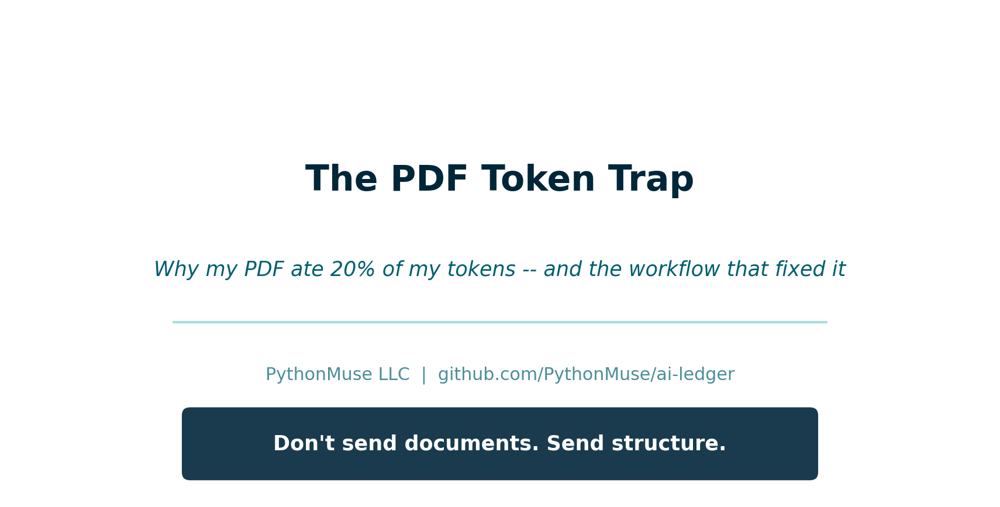
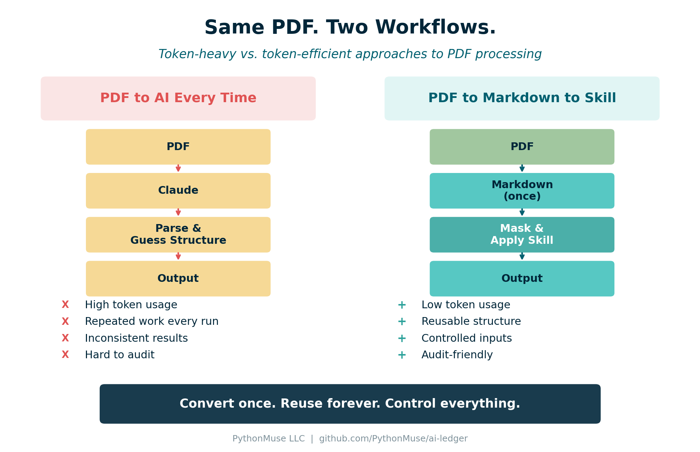
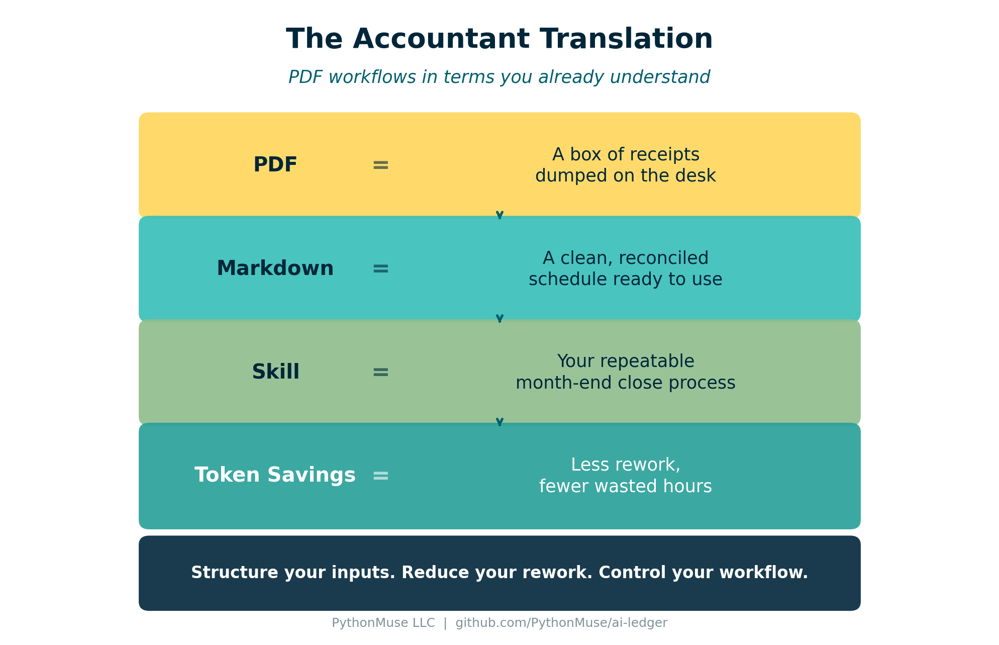

# The PDF Token Trap

*Why one PDF used nearly 20% of my tokens -- and the workflow that fixed it*

---

**PythonMuse LLC**
*Published April 2026*



---

## The Day My PDF Ate 20% of My Tokens

I had a simple goal: take a PDF bank statement, extract structured data, and build a clean, repeatable workflow.

So I did what most of us do. I opened Claude in VS Code, pointed it at the PDF, and asked it to pull the data I needed.

It worked. I got my answer and moved on.

The next month, I pointed Claude at the same type of statement and asked the same question. And the month after that. Each time, Claude re-read the entire document from scratch -- headers, footers, disclaimers, formatting noise, all of it -- just to get to the handful of numbers I actually needed.

Then I thought: "Wait. Instead of feeding Claude this PDF every single time, why don't I just ask it to write me a script that converts it to something structured -- once -- and then I just point the script at any new statement?"

That one question changed everything.

I asked Claude to build a small Python script that converts a PDF into clean Markdown. Claude wrote it. I ran it. And suddenly I had a structured file I could reuse, send specific sections from, and feed into a repeatable workflow -- without handing Claude the raw PDF ever again.

But here is the part that caught me off guard: that first month of feeding raw PDFs into Claude had already used nearly 20% of my token allowance.

At first I thought: "It is just a PDF... how expensive could it be?"

Turns out, raw PDFs are not expensive because the files are large. They are expensive because of the extra text, layout noise, and **interpretation** they require. Every time you upload a raw PDF, AI has to spend tokens figuring out what the document is before it can do the task you actually asked for.

---

## What AI Actually Sees When You Send a PDF

That "nice clean bank statement" you see on screen? That is for humans. AI sees something very different:

- Random line breaks
- Headers repeated on every page
- Tables that are not really tables
- Page numbers that are floating in space
- Formatting chaos pretending to be structure

It is a box of receipts dumped on a desk.

If you have read [Why Claude "Forgets"](../08-why-claude-forgets/), you already know that the context window is finite. PDFs eat through that window faster than you think -- not because of their size, but because AI has to spend tokens parsing extracted text, layout artifacts, and structure before it can do your task.

---

## Why Tokens Explode

When you send a raw PDF, AI has to:

1. Read everything (including headers, footers, page numbers)
2. Reconstruct the structure from extracted text and layout noise
3. Guess relationships between fields
4. Then -- finally -- do the task you actually asked for

That is like asking a new hire to rebuild your financials from a pile of receipts every single month. And you are paying for that interpretation in tokens, every single time you run the workflow.

---

## The Fix: PDF to Markdown (Once)

The moment I realized the problem, the fix was obvious:

**I did not need to send the PDF to AI every time. I needed to convert it to Markdown once -- and then reuse the structured result.**



*Figure: The token-heavy approach (left) repeats interpretation every run. The token-efficient approach (right) converts once and reuses structure.*

In [How Accountants Learn AI](../09-how-accountants-learn-ai/), we mentioned that converting a PDF to Markdown is one of the first useful skills to build. This article shows exactly why. The Markdown output becomes your structured layer -- the clean reconciled schedule that AI can work with directly.

---

## The PythonMuse Workflow

Here is the step-by-step approach that replaced my token-heavy mistake:

### Step 1: Convert Once

Take your PDF and convert it to Markdown. You can do this with:

- **A one-time Claude conversation** -- upload the PDF, ask Claude to convert it to structured Markdown
- **A Python script** -- using `pdfplumber` or `PyMuPDF` to extract text and tables, then clean them into Markdown

This is your conversion step. You do it once per document type.

### Step 2: Store Both Versions

```
/data/raw/
   statement.pdf          (original -- keep for reference)

/data/processed/
   statement.md           (structured -- this is what AI uses)
```

Now you have control, repeatability, and an audit trail. This follows the same folder structure used in the [PythonMuse Workflow Kit](https://github.com/PythonMuse/pythonmuse-workflow-kit).

### Step 3: Mask Sensitive Data

Before sending anything to AI, mask what needs to be masked:

- Replace names with IDs: `John Smith` becomes `Customer_001`
- Mask account numbers: `12345678` becomes `XXXX5678`
- Preserve the structure while removing sensitive content

This aligns directly with the [safe data workflows](../06-safe-ai-data-workflows/) we covered earlier. Converting to Markdown creates a natural checkpoint where you can strip sensitive content before it reaches AI.

### Step 4: Apply a Skill

Instead of asking AI to "figure it out," you now say: "Use this structured data and apply my extraction logic."

That extraction logic is a **Skill** -- a documented, repeatable set of instructions. [From One-Time Analysis to Repeatable Workflows](../11-one-time-to-repeatable-workflows/) introduced this concept. The Skill tells AI exactly what fields to extract, what format to use, and what rules to follow.

### Step 5: Output Structured Results

The output is clean JSON or CSV -- structured, validated, and consistent every run.

No more guessing. No more rebuilding. No more wasted tokens.

---

## The Accountant Translation

If this still feels abstract, here is the accounting translation:



*Figure: PDF workflow concepts translated into accounting equivalents.*

| Input | What It Means |
|-------|---------------|
| PDF | A box of receipts -- unstructured, needs interpretation |
| Markdown | A clean reconciled schedule -- structured and ready to use |
| Skill | Your repeatable close process -- documented once, executed consistently |
| Token savings | Reduced workpaper rework -- less time spent rebuilding what you already know |

---

## Control What You Send

Once you have Markdown, you gain something powerful: **control over what AI sees**.

Instead of uploading an entire 30-page bank statement, you can:

- Send only the transactions section
- Exclude headers, disclaimers, and marketing content
- Mask account numbers and names before the data leaves your machine

This is [Zero Trust](../13-zero-trust-ai-accounting/) in practice. You control exactly what AI receives, every single time.

**Before:**

> John Smith -- Account 12345678

**After masking:**

> Customer_001 -- XXXX5678

The structure stays intact. The sensitive data does not leave your environment.

---

## Try This: Start With One PDF

1. Pick one PDF report you use regularly (bank statement, vendor invoice, trial balance export)
2. Convert it to Markdown - prompt Claude: "Convert this to structured Markdown with tables preserved."
3. Save the Markdown in a `/processed/` folder alongside the original PDF
4. Next, ask Claude to summarize the conversion work as a Skill: what to extract, how to format it, what rules to follow, and which pages or sections matter.
5. Then ask Claude to create a second Skill for your actual analysis workflow. Include any extra columns you need, how to calculate them, and any repeatable cleanup rules you normally explain each time. Write those instructions in plain language, as if you were training an intern. Do not include confidential information.
   Hint: create a `prompt.md` file with a long, detailed prompt that tells Claude exactly what to include in the Skill. The more precise you are up front, the more reusable the Skill becomes. You may also find that some instructions belong in separate reusable Skills. For example, you may want one Skill that defines how all Excel outputs should be formatted across projects: thousands separators, no currency signs, and formulas visible during review.
6. Run both Skills against the Markdown and compare the experience with your previous PDF-based prompting workflow.
7. Now you have reusable Skills for the next time you perform the same analysis.
8. Notice the difference: faster execution, more consistent results, and lower token usage. The workflow becomes more predictable because you are no longer asking AI to rediscover the same process every time.

---

## Final Thought

Don't send documents. Send structure.

---

*Related: [The Power of Skills and Agents](../17-skills-and-agents-for-accountants/) | [Why Claude "Forgets"](../08-why-claude-forgets/) | [How to Use AI Without Sending the Wrong Data](../06-safe-ai-data-workflows/) | [From One-Time Analysis to Repeatable Workflows](../11-one-time-to-repeatable-workflows/) | ["AI Can't Work With Our Excel Files"... or Can It?](../15-ai-and-excel-files/) | [AI in Accounting Is About Control](../13-zero-trust-ai-accounting/)*
