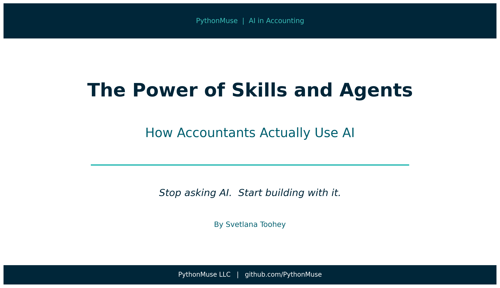
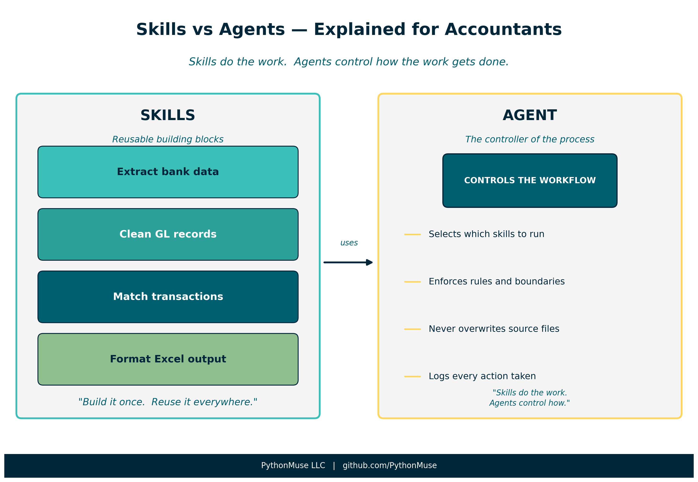
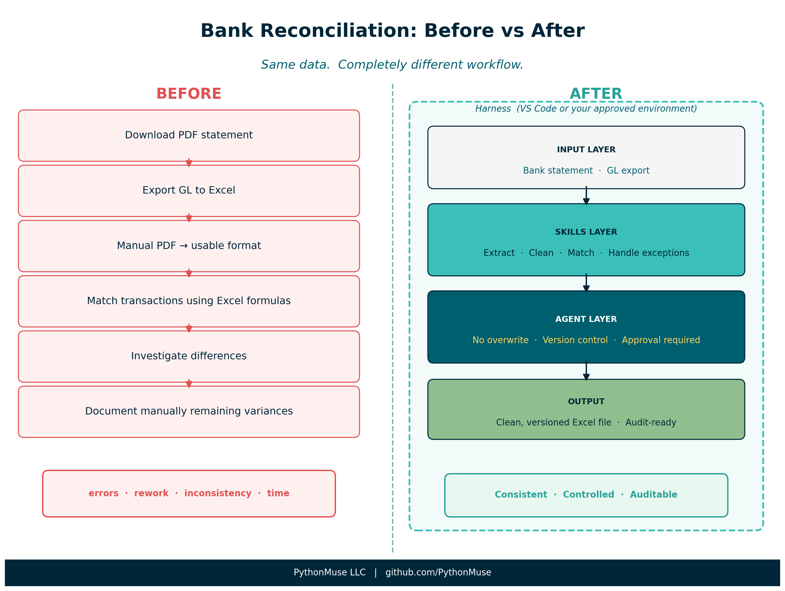
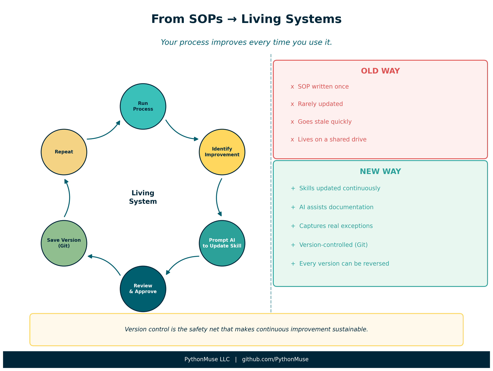
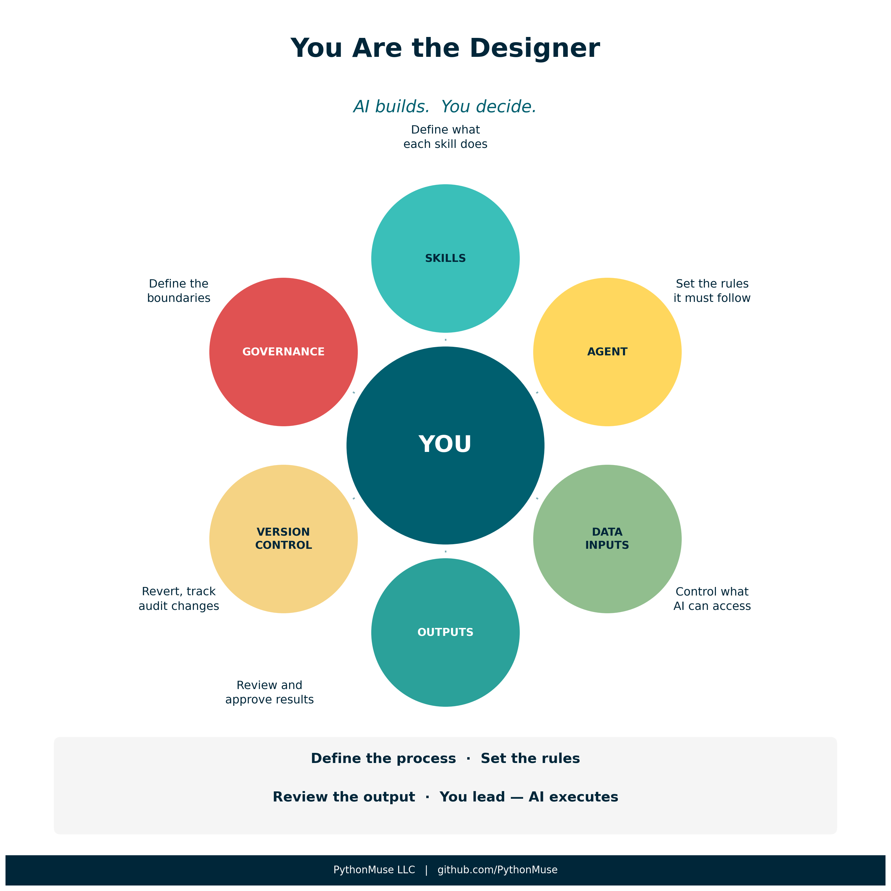

# The Power of Skills and Agents: How Accountants Actually Use AI

*From asking AI questions to building systems that do the work*

---

**By Svetlana Toohey**
*Published April 2026*

There was a time when learning Excel meant memorizing formulas.

Then one day, something clicked.

You stopped thinking about formulas... and started thinking about workflows.

AI is at that same moment right now for accounting.

Most conversations today are still happening at the "prompt" level. Ask a question. Get an answer. Maybe copy and paste it into Excel.

That is not where the real power is.

The real shift happens when you stop using AI... and start building with it.

---

> **A note on tools:** Everything in this article is based on how I work personally — using Claude as my AI model inside Visual Studio Code as my harness. But the concepts here — skills, agents, structured workflows — apply to whatever AI model and environment your organization has approved. Different organizations use different tools, just like we all run different versions of Excel. The underlying logic is the same; the interface is different. If you are unsure how to translate these ideas to your specific environment, drop me a comment and we will work through it together — or ask your AI team to read this article and explain how the same concepts apply to your setup.

---

## The Missing Piece: A Harness for AI

Before we talk about skills and agents, we need to talk about structure.

Because AI on its own is just a very smart assistant.

But AI inside a structured workspace becomes something completely different.

Think of tools like Visual Studio Code not as "coding environments" but as a **harness** you bolt onto your existing accounting workflows.

- Your folder structure becomes your control system
- Your files become your data boundaries
- Your instructions become repeatable logic

Instead of sending files into a black box, you bring AI into your environment — with rules.

And that is where skills and agents come in.

---

## Start Simple: Bank Reconciliation (Before AI)

Let's ground this in something every accountant understands.

A typical manual bank reconciliation might look like this:

1. Download bank statement (often PDF)
2. Export GL detail from accounting system (Excel or CSV)
3. Convert PDF to a usable format (manual or semi-manual)
4. Match transactions line by line
5. Investigate differences
6. Build reconciliation output in Excel

Even in a well-run system, there is still manual cleanup, repetitive logic, risk of inconsistency, and heavy time investment.

Now let's rebuild this using AI — but the right way.

---

## Skills: Your Reusable Accounting Intelligence

A skill is not just a prompt.

It is a documented, structured instruction that teaches AI how to perform a task — consistently.

**Think of skills as your standard operating procedures, written for AI.**

*Figure: Skills are the tools. The agent is the controller of how those tools get used.*

Instead of one big "do my bank rec" request, you break it into reusable pieces:

**1. Bank Statement Extraction Skill**
- How to interpret PDF or CSV bank data
- How to standardize dates, amounts, and descriptions
- How to handle odd formats such as check numbers with embedded text

**2. GL Data Preparation Skill**
- Which fields matter
- How to normalize formatting
- How to handle duplicates or grouped transactions

**3. Matching Logic Skill**
- Rules for matching transactions
- Tolerance thresholds
- Handling timing differences

**4. Reconciliation Output Skill**
- Standard column structure
- Formatting rules and naming conventions
- Versioning — never overwrite prior work

### Why This Changes Everything

You are no longer doing a task. You are building components.

- That bank extraction skill? Reusable for cash reporting.
- That GL cleanup skill? Reusable for variance analysis.
- That Excel output skill? Reusable across everything.

You build it once. You reuse it everywhere.

---

## Agents: The Controller of the Process

If skills are the tools, agents are the ones using them.

An agent is responsible for:

- Orchestrating which skills to use
- Enforcing rules
- Maintaining boundaries

And this is where accounting gets really interesting — because agents are not just about automation. **They are about control.**

### Agents as Your Internal Control Layer

In accounting, we do not just care about getting the answer. We care about accuracy, completeness, auditability, and data security.

This is exactly what agents enforce.

**Example agent rules:**

- Never modify original source files
- Always create versioned outputs
- Ask for approval before accessing sensitive files
- Mask sensitive data before any cloud processing
- Log all actions taken

**In practice, this is a file.**

Think of it as your `AGENT.md` — a plain-text document that defines how AI must behave inside your workflow. The rules, the boundaries, the context. Written in plain language, the same way you would write a memo to a new team member.

> **If you are working with Claude models specifically:** this file is your `CLAUDE.md`. It sits at the root of your project folder and Claude reads it every time it opens your project, before it does anything else. Your `CLAUDE.md` *is* the agent — not code, not a settings panel, just a document you can read, update, and version-control like everything else in your workflow.
>
> The concept is universal. The filename is Claude-specific. Same idea, different tools.
>
> A working example built for accounting workflows: [pythonmuse-workflow-kit/CLAUDE.md](https://github.com/PythonMuse/pythonmuse-workflow-kit/blob/main/CLAUDE.md)

This is not "AI doing work."

This is AI operating inside a control framework.

*Figure: Same data. Completely different workflow — with the harness providing the structure that holds it all together.*

---

## The Subtle but Critical Shift

| Without Structure | With Skills and Agents |
|---|---|
| AI is a tool you occasionally use | AI becomes part of your workflow system |
| One-off prompts | Reusable, documented logic |
| Inconsistent outputs | Controlled, versioned results |
| Experimentation | Transformation |

---

## Your Skills Become Living Documentation

Here is where things fundamentally change.

Documenting skills does something powerful beyond teaching AI. It creates clarity for your team.

Instead of static SOPs that go stale on a shared drive, you now have living documentation that:

- Improves every time you use it
- Captures real-world exceptions as they happen
- Reflects how work is actually done — not how it was done when someone wrote a policy document three years ago

And because you are working in a structured, version-controlled environment:

- Every change can be reviewed
- Every version can be tracked
- Every mistake can be reversed

That last point matters more than it sounds. When you know you can revert, you stop being afraid to improve your process. You can experiment safely.

*Figure: The continuous improvement loop — with version control as the safety net that makes it sustainable.*

---

## You Are the Designer, Not Just the Preparer

Reading all of this, you might be thinking: "This sounds powerful... but also like a lot to build."

Here is the truth:

**You are not writing most of it. AI is.**

Your role is to be the designer. You decide:

- What the skill should do
- What rules the agent should enforce
- What "good" looks like in your process

Then you ask AI to create it.

### How It Actually Works in Practice

You do not start by writing a perfect skill. You start by saying something like:

*"Create a skill that explains how to reconcile a bank statement to GL, including how to handle check numbers with embedded text and timing differences."*

AI drafts it. Then you review it, adjust it, and add your nuances. Within minutes — you have a structured, reusable skill.

Then, when you run the process and encounter an exception, you do not stop and say "we should update the SOP." Because let's be honest — that rarely happens. SOPs go stale.

Instead, you simply say:

*"Update this skill based on what we just did — include how we handled that exception."*

AI updates it. You review. You approve. And just like that — your process evolves.

*Figure: Your role is to define the process, set the rules, and review the output. AI executes within that structure.*

---

## A Glimpse Into What Is Coming Next

This space is evolving fast. We are now starting to see early versions of:

- Scheduled workflows
- Recurring AI routines
- Trigger-based automation

Think about what that means for accounting:

- Daily cash reconciliation → runs automatically
- Monthly reports → prepared before you log in
- Exception reports → flagged proactively

These capabilities exist today in tools like Claude Code. I have not yet applied them to an accounting workflow in a way I would consider production-ready — but once I do and have something practical to share, I will document it here with a real example.

If you have already used scheduled or recurring AI routines in your accounting work, I would love to hear what you built and how it is working. Drop a comment or reach out — this space is moving fast and the community's experience is genuinely valuable here.

---

## Final Thought: This Is How the Profession Evolves

AI in accounting is not about replacing people.

It is about elevating how we work.

The accountants who will thrive are not the ones who use AI occasionally. They are the ones who:

- Build structured workflows
- Define reusable skills
- Operate within controlled environments

That is the shift — from doing the work to designing how the work gets done.

And the great news: you do not need to be a developer to do this. You need to be a clear thinker who understands your process. That is already your job.

---

*Related: [Stop Using One AI Like It Is Excel](../14-ai-team-for-accountants/) | [From One-Time Analysis to Repeatable Workflows](../11-one-time-to-repeatable-workflows/) | [When to Trust AI to Run Your Accounting Workflows](../12-audit-ready-ai-workflows/) | [The PDF Token Trap](../16-pdf-token-trap/) | [AI Governance for Controllers](../07-ai-governance-for-controllers/)*
