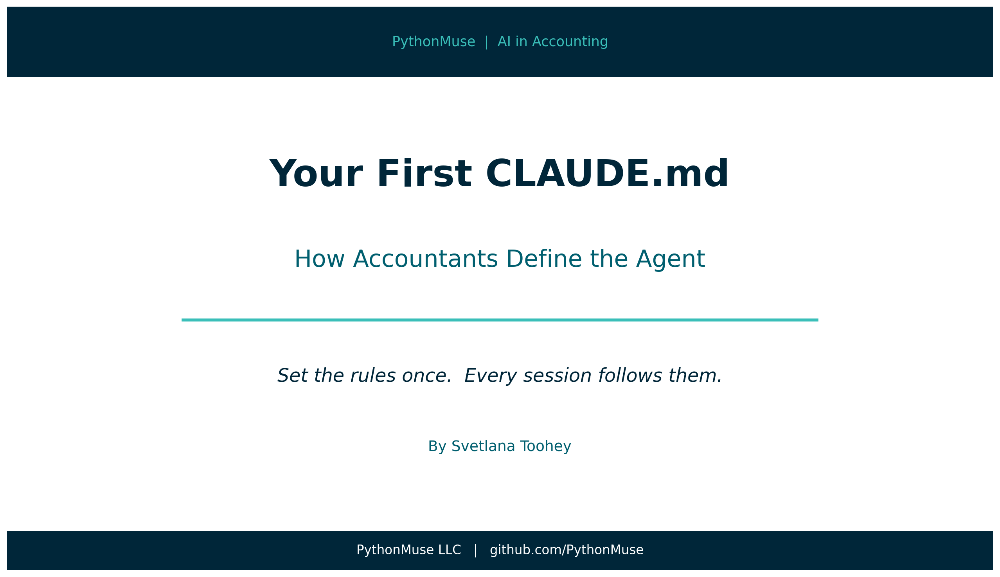
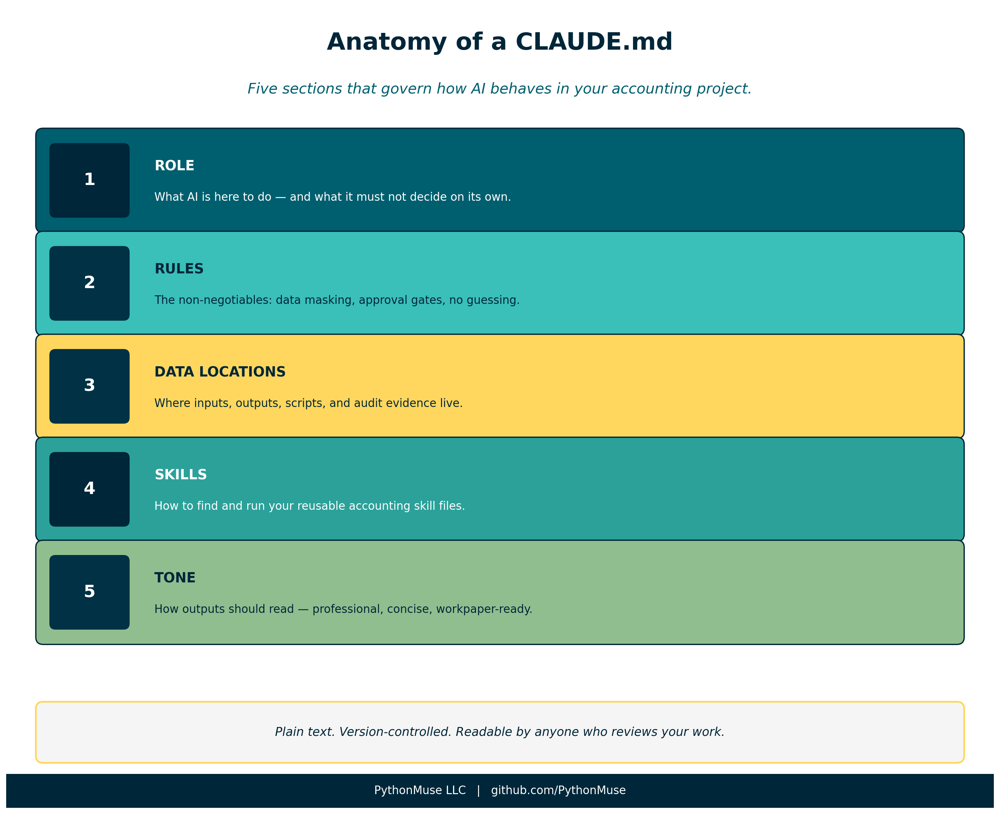
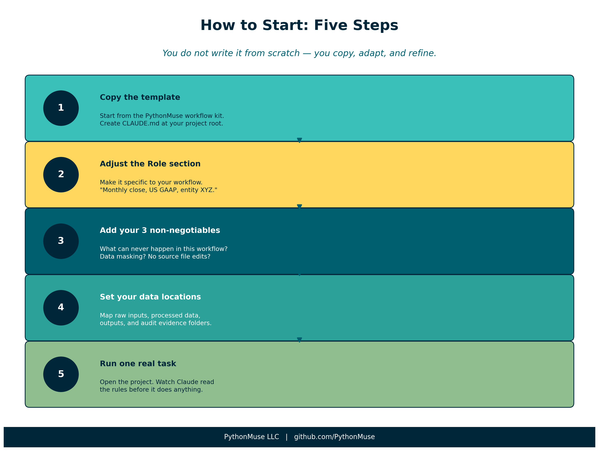
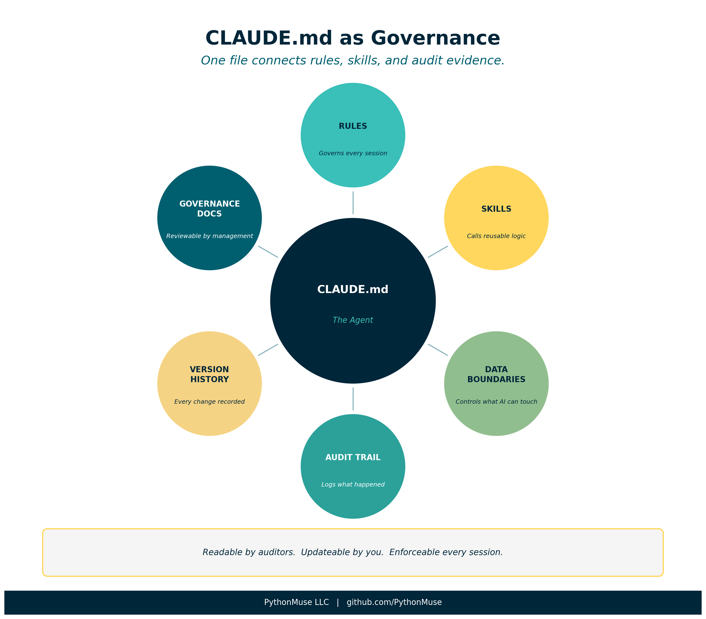

# Your First CLAUDE.md: How Accountants Define the Agent

*The most important document you will write in an AI-assisted accounting workflow is not a spreadsheet*

---

**By Svetlana Toohey**
*Published 2026*



In the previous article, we talked about skills and agents — and introduced the idea that in Claude Code, the "agent" is not a separate tool or setting. It is a file.

That file is your `CLAUDE.md`.

This article is about what goes in it.

---

> **A note on tools:** This article is written specifically for Claude Code and Claude models used inside VS Code or a similar harness. If you are using a different AI environment, the concept still applies — you may call the file something else, or configure rules through a different mechanism. The underlying logic is the same: you define how AI must behave before it starts work. Check with your IT or AI team on how this translates to your specific setup.

---

## What CLAUDE.md Actually Is

Every time you open a project in Claude Code, Claude reads the `CLAUDE.md` file before doing anything else.

Think of it as the briefing document you hand a new team member on their first day.

Before they touch a single file, they read:

- What this project is
- What they are allowed to do — and not allowed to do
- Where things live
- What "done well" looks like here

Your `CLAUDE.md` does exactly that — for AI.

**What it is not:**

- It is not code
- It is not a settings panel
- It is not technical

It is plain text. You write it in plain language. You can read it, update it, and version-control it alongside everything else in your project.

And because it sits in your project folder — not in a cloud profile or a vendor system — *you* own it.

---

## Why This Changes Everything for Accounting

In most AI workflows, especially when you are just starting out, every session starts from zero.

You open a chat. You explain the context. You remind the AI what not to do. You re-establish the rules. And then — maybe — you get consistent output.

That is exhausting. And it is not auditable.

With a `CLAUDE.md`, the rules are set once. They apply to every session in that project. You stop re-explaining and start governing.

| Without CLAUDE.md | With CLAUDE.md |
|---|---|
| Explain context every session | Context loads automatically |
| Remind AI not to guess | Rule enforced from the start |
| Hope for consistent output | Behavior is defined and repeatable |
| Hard to document what AI did | AI operates inside documented rules |
| Difficult to get colleague to replicate | Anyone can open the project and follow the same rules |

That last row matters more than it sounds. An auditor — or your manager — can read your `CLAUDE.md` and understand exactly how the AI was constrained during a workflow. That is governance documentation.

---

## Anatomy of a CLAUDE.md for Accounting

Let us walk through a real working example — built for accounting workflows and available in the [PythonMuse workflow kit](https://github.com/PythonMuse/pythonmuse-workflow-kit/blob/main/CLAUDE.md).


*Figure: The five sections of an accounting-ready CLAUDE.md and what each one does.*

### Role

```
## Role

You are a co-pilot for an accounting professional. Your job is to assist
with data analysis, reconciliation, and reporting workflows -- not to make decisions.
```

This is the most underrated line in the entire file.

"Not to make decisions" is not a polite disclaimer. It is a governance rule.

It tells Claude that every judgment call — materiality, account mapping, exception treatment — belongs to you. Claude provides analysis. You decide what to do with it.

This distinction matters enormously in regulated environments where professional sign-off is required.

---

### Rules

```
## Rules

1. Never process raw sensitive data. If the user provides unmasked names, SSNs,
   bank account numbers, or tax IDs, stop and ask for a masked version.
2. Always read plan.md first. Before starting any work, read plan.md to understand
   the objective, rules, and steps.
3. Propose before executing. Before processing data, describe your plan and wait
   for approval.
4. Save all outputs. Write results to the /outputs folder with clear file names.
5. Update status. After completing a milestone, update status_update.md with what
   was done, where files are saved, and what comes next.
6. Do not guess. If something is unclear, ask. Do not assume materiality thresholds,
   account mappings, or business rules.
7. Keep it reproducible. Every step should be documented well enough that someone
   else could repeat the process and get the same result.
```

These seven rules represent the core of what most accounting workflows need.

A few are worth calling out specifically:

**Rule 1 — Data masking:** This is your first line of defense before any data reaches an AI model, whether it runs locally or in the cloud. Make it explicit. Make it unconditional.

**Rule 3 — Propose before executing:** This is the "approval gate" that distinguishes a governed AI workflow from an autonomous one. You review the plan before Claude acts. This is not bureaucracy — it is the same principle as a preparer/reviewer workflow in your close process.

**Rule 6 — Do not guess:** This is where most AI workflows fail silently. Without this rule, Claude will make reasonable-sounding assumptions about account mappings, rounding, timing differences — and document none of them. With this rule, unclear items surface before they become errors in your output.

---

### Data Locations

```
## Data Locations

- Raw inputs: /data/raw/
- Processed/cleaned data: /data/processed/
- Scripts: /src/
- Results and reports: /outputs/
- Audit evidence: /evidence/run-logs/
```

This section maps the folder structure so Claude always knows where to look and where to write.

It also enforces separation of raw and processed data — a principle every accountant already understands from working with source documents vs. workpapers.

Notice `/evidence/run-logs/`. This is where Claude documents what it did during each session. Combined with version control, this gives you a timestamped trail of AI activity — not just the outputs, but the process that produced them.

---

### Skills

```
## Skills

If the user asks you to use a skill, read the SKILL.md file in the relevant
/skills/ folder and follow it exactly.
```

This connects your `CLAUDE.md` to the skills system covered in Article 17. When you say "run the bank reconciliation skill," Claude finds the right file, reads the instructions, and executes them consistently.

Skills are your reusable logic. `CLAUDE.md` is what tells Claude to use them — and use them exactly as written.

---

### Tone

```
## Tone

- Clear, concise, and professional
- Suitable for workpaper documentation
- No speculation or dramatic language
```

Do not underestimate this section. Without it, AI output defaults to the tone of a consultant selling a project — expansive, hedged, full of qualifiers.

"Suitable for workpaper documentation" is a precise instruction. It tells Claude the output may end up in a file that someone reviews, signs off on, or audits. That changes word choice, structure, and what gets left out.

---

## How to Write Your First CLAUDE.md

You do not need to write it from scratch.

Start with the [workflow kit template](https://github.com/PythonMuse/pythonmuse-workflow-kit/blob/main/CLAUDE.md) and adapt it to your workflow.

Here is a practical approach:

**Step 1 — Copy the template.** Create a `CLAUDE.md` file at the root of your project folder. Paste in the template as a starting point.

**Step 2 — Adjust the Role section.** Make it specific to your workflow. *"You are assisting with the monthly close process for an entity with US GAAP reporting requirements."* The more specific, the better.

**Step 3 — Add your top 3 non-negotiables.** Every accounting environment has rules that cannot be broken — data never leaves the approved environment, source files are never modified, certain accounts require management sign-off. Add these explicitly. Do not assume Claude will infer them.

**Step 4 — Set your data locations.** Match the folder structure of your actual project. If you do not have one yet, use this as the moment to design it intentionally.

**Step 5 — Run one real task.** Open a project with your new `CLAUDE.md` and run something simple — a file check, a data summary, a quick reconciliation. Watch how Claude's behavior differs when it reads the rules first.


*Figure: Five steps to your first working CLAUDE.md.*

---

## CLAUDE.md as Living Governance Documentation

Here is the part that surprises most accounting professionals when they first see it.

Your `CLAUDE.md` is also a governance artifact.

When a manager asks *"how did the AI handle this reconciliation?"*, the answer is not buried in a chat log. It is in a plain-text file, version-controlled alongside the work, readable by anyone with access to the project.

When a colleague needs to replicate the process, they do not need to reconstruct your thinking. They open the project, read the `CLAUDE.md`, and the rules are already there.

And when the rules need to change — a new data masking requirement, an updated materiality threshold, a new approval step — you update the file, commit the change, and every future session runs under the new rules. The old version remains in git history.


*Figure: CLAUDE.md sits at the center of a governed AI accounting workflow — connecting rules, skills, and audit evidence.*

---

## What to Add as You Go

Your first `CLAUDE.md` will be simple. That is correct.

You will add to it when:

- An exception occurs that the AI handled wrong — add a rule
- A new skill gets built — add a reference to it in the Skills section
- A reviewer asks a question you cannot easily answer from the output — add a logging or documentation rule
- Your data structure changes — update Data Locations

The file gets better every time you use it. That is the same principle as the living documentation loop in Article 17.

---

## Final Thought

There is a version of AI in accounting where every session is a fresh conversation — no memory, no rules, no constraints. You get an answer. You move on.

And then there is a version where AI operates inside a project that knows what it is supposed to do, what it is not allowed to do, and how to document what it did.

That second version is auditable. It is repeatable. It is defensible.

Your `CLAUDE.md` is the difference between the two.

---

*Related: [The Power of Skills and Agents](../17-skills-and-agents-for-accountants/) | [When to Trust AI to Run Your Accounting Workflows](../12-audit-ready-ai-workflows/) | [AI Governance for Controllers](../07-ai-governance-for-controllers/) | [How to Use AI Without Sending the Wrong Data](../06-safe-ai-data-workflows/) | [PythonMuse Workflow Kit](https://github.com/PythonMuse/pythonmuse-workflow-kit)*
