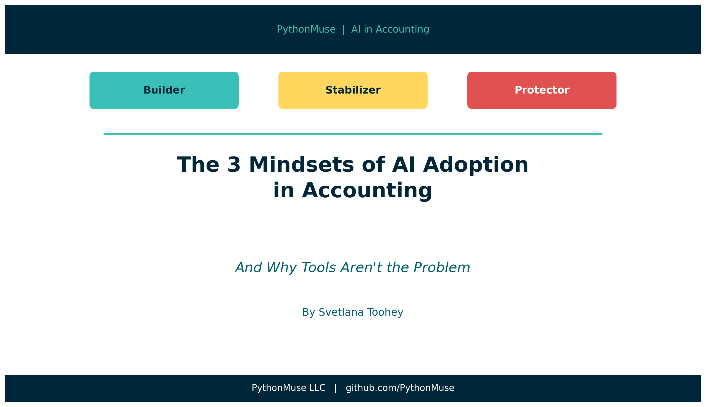
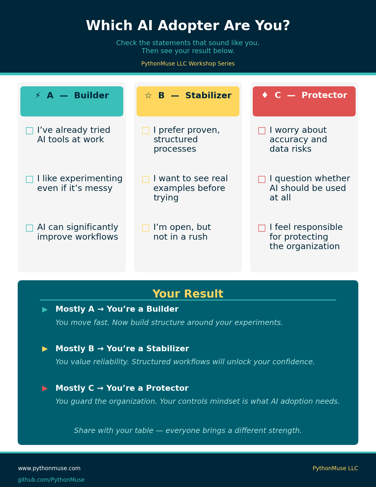
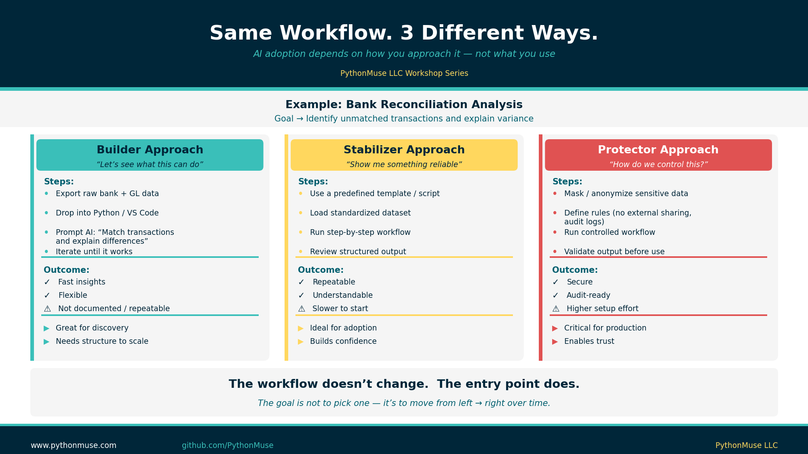
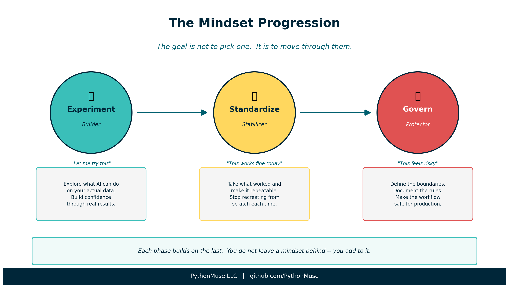

# The 3 Mindsets of AI Adoption in Accounting

*And why tools aren't the problem*

---

**By Svetlana Toohey**
*Published April 2026*

---

## Let's Be Honest

I've sat in enough rooms with finance professionals this year to notice something.

AI isn't failing in accounting because of the technology.

It's failing because of how we respond to change.

Same tools. Same access. Same CPE courses. Yet in a room of sixty finance professionals, five are building, forty are watching, and fifteen are quietly resisting.

Why?

Because AI adoption isn't a skill problem. It's a mental model problem.

---

## The PythonMuse Mental Model

After workshops and conversations with Controllers, CFOs, and auditors, I kept seeing the same pattern. It wasn't based on age, technical ability, or role. It was based on how people emotionally process change.

Before reading further -- take a moment to identify where you are.

> **Which type are you?**

*Figure: Use this self-assessment to identify your AI adoption mindset before continuing.*

Most people land in one place. And that place shapes everything about how they learn, experiment, and adopt new workflows.

---

## Builders: "Let me try this"

You're already moving. You don't need convincing -- you need leverage.

You're probably already feeling something like this:

- "I built something once, but I can't reproduce it."
- "This worked yesterday, but I don't remember how."
- "Can I actually show this to auditors?"

You're solving problems. But you're not yet building systems.

Here's what that looks like in practice.

**Bank Reconciliation:** You export bank and GL data, drop it into Python, and ask AI to match transactions and explain differences. The results are fast. But the workflow isn't documented or repeatable. Next month, you start from scratch.

**Variance Analysis:** You upload current vs. prior year data and ask AI to explain major variances. The narrative is great -- but the output is different every time.

**Invoicing Review:** You feed invoice data into AI and find real insights. But there's no standardized workflow, which means the next run may look nothing like this one.

The gap isn't what you're producing. It's that you're not producing it *consistently*.

Once you add structure to what you're already doing, you stop being:

> *"the person who tries things"*

And become:

> **"the person who scales solutions"**

If you've been following the series, the shift from one-time prompt to reusable skill is exactly what [From One-Time Analysis to Repeatable Workflows](../11-one-time-to-repeatable-workflows/) and [The Power of Skills and Agents](../17-skills-and-agents-for-accountants/) are built around. That's where Builders go next.

> From "one-time prompt" -- to a **reusable skill**

---

## Stabilizers: "This works fine today"

You're not behind. You're protecting what works.

You're probably thinking:

- "Everything feels too abstract or too technical."
- "I don't trust what I don't understand."
- "I don't want to break something that works."

What you need isn't theory. You need proof that it works in your world -- with your data, your process, your team.

**Bank Reconciliation:** What works for you is a standardized dataset, a pre-built script or workflow, and clear steps: load the data, run the match, review exceptions. Same result every time. Easy to explain to anyone who asks.

**Variance Analysis:** A structured template with defined input and output -- current vs. prior, categorized variances -- gives you consistent explanations that are easier to validate.

**Invoicing Review:** Predefined checks for missing invoices, outliers, and timing issues mean a reliable process with less manual effort.

Once you run one structured workflow from start to finish, you stop being:

> *"the person who watches others try"*

And become:

> **"the bridge between traditional accounting and modern workflows"**

You don't need to understand every technical detail. You need to see it work once, in your environment, on your data. Confidence follows.

> From "watching others try" -- to **running your first workflow**

---

## Protectors: "This feels risky"

You're not resistant. You're responsible.

You're probably asking:

- "What if the data is wrong?"
- "What if sensitive data is exposed?"
- "What if auditors question this?"

These aren't obstacles. They're design requirements.

**Bank Reconciliation:** Your approach masks sensitive data before processing, uses a controlled environment, and requires matching logic documentation with an audit trail. The outcome is secure and defensible.

**Variance Analysis:** You ensure inputs are validated, logic is documented, and outputs are reviewed before they inform any decision. The result is trustworthy analysis.

**Invoicing Review:** No direct external sharing. Defined rules for anomaly detection. Review checkpoints at every stage. Controlled automation.

Without Protectors, AI in accounting becomes unsupervised experimentation. With Protectors, it becomes trusted infrastructure.

You become:

> **"the person who makes AI safe to use"**

The governance frameworks in [AI Governance for Controllers](../07-ai-governance-for-controllers/) and the data controls in [How to Use AI Without Sending the Wrong Data](../06-safe-ai-data-workflows/) were written with you in mind.

> From "blocking AI" -- to **designing safe AI**

---

## The Same Workflow, Three Entry Points

Here's what most people miss: the workflow itself doesn't change based on your mindset.

The same bank reconciliation -- export data, match transactions, review exceptions, document results -- can be approached from any of the three entry points. What changes is *how* you start and what you optimize for.

*Figure: The same bank reconciliation workflow approached as a Builder, Stabilizer, and Protector. The entry point changes -- the destination is the same.*

The goal isn't to pick the "right" mindset. It's to understand where you're starting from -- so you can move in the right direction.

---

## The Real Opportunity

Each mindset is missing something:

- Builders need **structure**
- Stabilizers need **proof**
- Protectors need **control**

When those three needs are addressed -- and when all three mindsets exist in the same room -- something shifts. AI workflows become repeatable, reliable, and audit-ready.

This isn't a coincidence. It reflects the natural progression of any new capability in accounting: you explore it, you standardize it, you govern it.

---

## The Progression

The goal isn't to pick one mindset and stay there. It's to move through them.

*Figure: The mindset progression -- Experiment, Standardize, Govern. Each phase builds on the last.*

**Experiment (Builder)** -- You try things. You find out what AI can actually do on your data. You build confidence by seeing real results.

**Standardize (Stabilizer)** -- You take what worked and make it repeatable. You build a workflow others can follow. You stop recreating from scratch each time.

**Govern (Protector)** -- You define the boundaries. You document the rules. You make the workflow safe enough to rely on in production.

Take the exploratory energy of Builders, give it the structure Stabilizers need, and protect it with the controls Protectors require. That combination is what makes AI sustainable in an accounting environment.

If you want to see this progression mapped to specific skills and tools, [How Accountants Learn AI](../09-how-accountants-learn-ai/) walks through the full arc.

---

## Try This: Find Your Starting Point

1. Take the self-assessment above. Identify your dominant mindset -- Builder, Stabilizer, or Protector.
2. Find one workflow you already do manually (bank reconciliation, variance analysis, invoice review).
3. Apply your mindset honestly:
   - If you're a Builder -- document the next workflow you run. Write down the steps while they're still fresh.
   - If you're a Stabilizer -- find one pre-built template or script and run it exactly as written. Resist the urge to modify it first.
   - If you're a Protector -- define the three rules any AI workflow must follow in your environment before you run it.
4. Share your mindset with one colleague. You may be surprised to find you're different types -- and that difference is an advantage, not a problem.

---

## Final Thought

Before you learn another AI tool, ask yourself:

Am I trying to move faster? Am I trying to feel more confident? Or am I trying to make this safe?

Your answer determines how you should start.

The future of accounting won't be built by one type of person. It will be built by Builders who explore, Stabilizers who operationalize, and Protectors who make it trusted.

AI won't replace accountants. But accountants who understand their role in this shift will define what the profession becomes next.

---

*Related: [How Accountants Learn AI](../09-how-accountants-learn-ai/) | [From One-Time Analysis to Repeatable Workflows](../11-one-time-to-repeatable-workflows/) | [AI Governance for Controllers](../07-ai-governance-for-controllers/) | [How to Use AI Without Sending the Wrong Data](../06-safe-ai-data-workflows/) | [The Power of Skills and Agents](../17-skills-and-agents-for-accountants/)*
