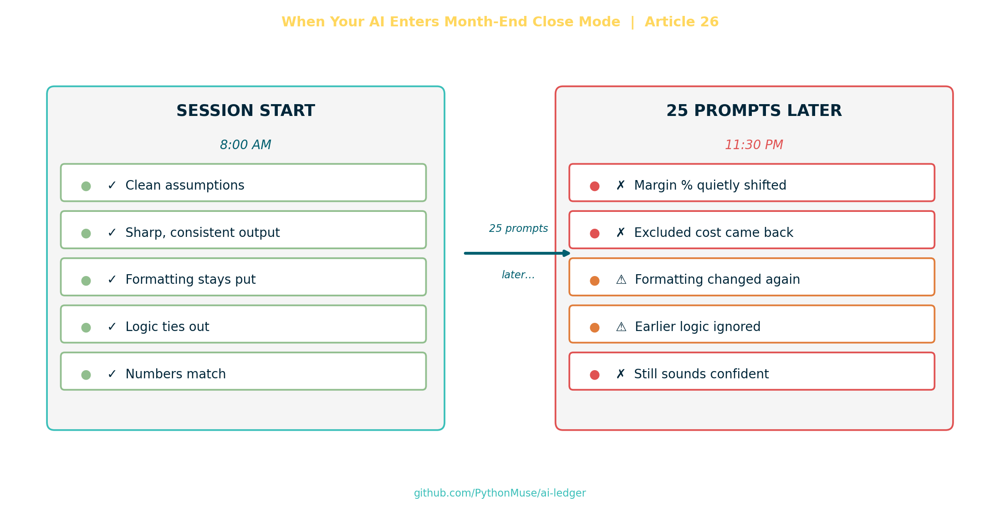
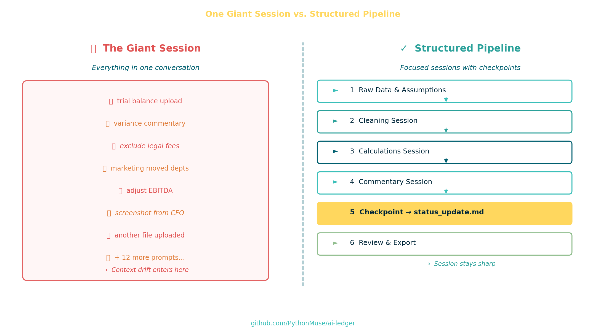

# When Your AI Enters Month-End Close Mode

*Why **long AI sessions** drift — and how accounting and finance professionals can apply the controls they already know to protect their output*

---

**PythonMuse LLC**
*Published May 2026*

---

## The Session Started Beautifully

Picture this: you give AI access to a trial balance, departmental expenses, and budget amounts, and ask it to analyze the results.

> ⚠️ **A quick note on data safety.** Before sharing any financial data with an AI tool, think carefully about what you are uploading and where it is going. We strongly encourage masking, anonymizing, or summarizing sensitive data before it leaves your environment. See: **[How to Use AI in Accounting Without Sending the Wrong Data →](../06-safe-ai-data-workflows/)**

Within seconds, the AI generated clean variance commentary:

- professional tone
- clear explanations
- actionable insights
- a few phrases that sounded suspiciously board-ready

For a brief moment, it feels like magic and an idea that you may have discovered a "free" labor.

Then month-end close happened.

Not actual month-end close. *AI* month-end close.

---

## Just One More Thing

Then real life happens. You realize the analysis did not capture company specifics that only a few key people remember. So you start iterating with additional prompts, such as:

> "Can you exclude one-time legal fees?"
> "Actually, marketing moved 1 headcount to another department in March."
> "Ignore the accrual reversal."
> "Can you make the tone more strategic?"
> "Use adjusted EBITDA."
> "No tables."
> "Actually, tables were better."
> "Can you compare against quarterly forecast too?"
> "I uploaded another file."

Twenty prompts later, the AI was confidently explaining the wrong gross margin percentage using assumptions we abandoned half an hour earlier.

And that is where many accounting and finance professionals begin saying things like:

> "AI just makes stuff up."

But there is usually a better explanation.

The session is drifting.

---

## Something Feels Off

The dangerous failures are rarely obvious.

The AI does not stand up and announce:

> "Attention finance team. I am now drifting."

Instead:

- formatting quietly changes
- assumptions weaken
- calculations subtly shift
- exclusions quietly disappear
- prior instructions fade away

The output still sounds intelligent.

Which honestly makes it worse.

Because now you are reviewing something that looks polished while the underlying logic slowly drifts away from what you actually asked for.

> The danger is not when AI becomes obviously wrong.
> The danger is when it becomes confidently inconsistent.

That is a very real fear for most of us.

---

## Humans Have a Working Memory Limit

At this point you might be thinking:

> If humans lose track of too many moving parts, that makes sense.
> But why would AI have the same problem? After all, AI is running on a computer.

To answer that, it helps to start with the human side first — because the failure pattern is the same one accountants have been managing for decades.

Humans can only hold so many active moving parts in mind at one time.

That is the old "7 plus or minus 2" idea — Miller's classic observation about working memory.

The exact number is less important than the pattern:

Once too many open items compete for attention, details begin drifting.

Month-end close is a familiar version of that problem.

At the beginning of close, everything feels manageable.

You know:

- accruals still need posting
- bank recs are pending
- AP cutoff matters
- payroll needs review
- intercompany has to tie
- the CFO wants commentary
- auditors asked questions
- someone just found a significant variance in marketing year-over-year expenses

At first, your brain can juggle it.

Then more gets layered on:

- "Use updated FX rates."
- "Actually exclude Canada."
- "Board deck is due early."
- "Don't forget the lease entry."
- "We changed account mappings and need to update all relevant files."
- "Use the revised headcount file — the one ending in `.vF.FOR_Real`."
- "Ignore that adjustment from yesterday."
- "Can you also train the new staff accountant?"

At some point, your mental stack starts collapsing.

Not because you are bad at accounting.

Because complexity has exceeded working memory.

Notice anything familiar? Swap 'you' for 'AI' and that second list is the same conversation. Same shape, same drift, same root cause.

That is the bridge to AI.

---

## Why AI Can Drift Too

An AI chat is not a database, an ERP, or a controlled accounting system. It is closer to working memory — and working memory has limits, whether it lives in a human brain or a language model.

AI models operate inside something called a **context window**.

Think of it as the active workspace for the conversation.

Not permanent memory.
Not institutional knowledge.
Not a system of record.

As the conversation grows longer, the model compresses older content to make room for what is new. Earlier instructions may still technically exist somewhere in the conversation, but after compression they do not carry the same weight — details get de-prioritized, softened, or simply harder to retrieve.

> 💡 **The user has no control over what gets deprioritized.** The AI makes that choice — and it cannot tell the difference between a firm constraint you set early on and a casual comment from the same prompt. A critical decision made in prompt 3 can quietly lose ground to newer instructions by prompt 30. This is exactly why externalizing your key assumptions into a file (rather than trusting the chat to remember them) is not optional — it is your only reliable protection.

Newer requests start competing with older instructions.

Files, screenshots, formatting rules, exclusions, tone changes, and revised assumptions all pile into the same working space.

So during a **long AI session**, you can get the equivalent of:

- forgetting an accrual
- using the wrong assumption
- posting to the wrong entity
- changing formatting halfway through
- contradicting prior instructions
- redoing work the AI already completed

In accounting terms:

the close starts losing quality because too many balls are in the air at once.

---

## The Accounting Control Lesson

That is why experienced controllers do not run close from memory alone.

They create:

- close checklists
- status trackers
- workpapers
- recurring journal templates
- review notes
- standardized folders
- sign-offs

Not because accountants are forgetful.

Because complexity exceeds working memory.

Good AI workflows do the same thing.

Your:

- `plan.md`
- `status_update.md`
- reusable prompts
- SKILL files
- scripts
- structured folders

are basically the AI equivalent of a controlled month-end close process.

> 📌 **PythonMuse framework note.** The files listed above reflect the PythonMuse workflow approach. This is one way to structure AI memory — not the only way. AI tooling and best practices are evolving fast. We encourage you to check what your tools currently recommend, explore what the broader community is building, and adapt or invent your own system. The principle matters more than the specific file names: move memory out of the chat and into something structured and repeatable.

You are reducing cognitive overload by moving memory out of the chat and into structured systems.

That is also why AI sessions often feel smart at first and then slowly degrade over time.

It is the same energy as:

> Day 1 of close: "We got this."

versus

> Day 5 at 11:47 PM: "Why is retained earnings off by $18.42?"

---

## How to Reduce Context Drift

### 1. Stop Treating AI Chats Like Permanent Systems

An AI conversation is not an ERP.

It is temporary working memory.

Huge difference.

### 2. Externalize Important Context

Critical assumptions should not live only inside the chat.

Store them externally:

- `assumptions.md`
- `status_update.md`
- SKILL files
- SOP documents
- reusable workflow instructions

Professional accounting workflows already do this.

AI workflows should too.

This is exactly what SKILL files are for. A SKILL file is a reusable instruction document your AI reads before starting work — not just a prompt, but a structured set of rules your workflow can depend on session after session.

See an example from this series: **[Accounting Number Normalization Skill →](../../examples/skill-accounting-number-normalization/SKILL.md)**

Also available in the [PythonMuse Workflow Kit](https://github.com/PythonMuse/pythonmuse-workflow-kit).

### 3. Use Checkpoints

Before changing directions, capture:

- assumptions
- exclusions
- current conclusions
- open questions

AI has no save button.

Throughout your work, create one by prompting AI:

> "Update status_update.md. Summarize current assumptions, what we've completed, and what comes next."

That is your Ctrl+S for an AI session.

> 🔁 **For more advanced users — this is where version control comes in.** Git is the professional answer to this problem. When your assumptions, plans, and outputs live in files, you can commit them like code — creating a full, timestamped history of what changed and when. If you are already using git or want to explore it, see the [Workings Template](../../examples/workings-template/) in this repo for a practical starting point built around AI-assisted accounting workflows.
>
> 🌱 **New to version control?** No worries — you do not need it to get started. Focus on the checkpoint habit first. We will be publishing beginner-friendly articles on version control for accounting teams. In the meantime, the Workings Template examples in this repo show what a git-backed AI workflow looks like in practice.

### 4. Break Large Workflows Into Smaller Sessions

Do not build one giant "everything chat."

Separate the work into focused sessions — ideally each backed by its own `SKILL.md` file:

- data cleaning
- calculations
- commentary
- exports
- review

Each `SKILL.md` captures the rules, assumptions, and scope for that one task — so the AI starts every session with a clean, explicit context instead of inheriting a cluttered one.

Shorter focused sessions consistently produce more reliable outputs than endless conversations.

Sometimes the best way to fix AI performance is the same way you regain control during a messy close:

Start clean.

---

---

## What Comes Next: Thrashing

Context drift is the subtle failure mode.

But overloaded sessions can eventually enter something even more chaotic:

- conflicting instructions
- repeated reversals
- unstable outputs
- constant rewriting
- logic oscillation

It is called **thrashing**.

Picture this: you ask the AI to calculate gross margin. It gives you 42%. You push back. It recalculates and says 38%. You ask it to explain the difference. It confidently walks you through the math — and lands back at 42%. At some point the AI is essentially arguing with itself while you watch, wondering if you should just open Excel.

That deserves its own article (and it's coming).

---

## Final Thought

The future of AI in accounting will not belong to the people who can chat with AI the longest.

It will belong to the teams that know how to:

- structure memory
- preserve assumptions
- checkpoint logic
- design audit-proof workflows
- build repeatable processes around AI's limitations

Accountants already solved these problems decades ago.

We just called them:

- controls
- documentation
- versioning
- workflow design
- governance

Working with an AI workforce is no different.

The control problem is familiar — and so is the solution.

You have been building the instincts for this your entire career. The checklists, the workpapers, the sign-offs, the structured folders — those were never just accounting habits. They were memory systems. Reliability frameworks. Ways of making complex work repeatable and reviewable.

That is exactly what AI needs from you now.

Not a developer. Not a data scientist. An accountant who understands control — and knows how to apply it.

> **Start where you are.** Pick one workflow you run this month. Add a `status_update.md`. Write one `SKILL.md`. Break it into focused sessions. See what changes.
>
> The future of AI in accounting is being built by people exactly like you — one controlled, repeatable workflow at a time.

---

> **A note on how this article was made.** This article started with me. The experience, the problem, and the patterns I recognized are mine — I shared what actually happens in **long AI sessions** and how accounting discipline applies. ChatGPT helped me shape that into a structured draft. GitHub Copilot helped build the article, revise the flow, and create the visual assets — working from my direction and feedback at each step. I reviewed every output, pushed back on things I didn't like, and made all final re-writes. That process — bringing your own experience, using AI to build and iterate, and staying in the editorial seat throughout — is exactly what this series is about.

---

*Related: [Why Claude "Forgets"](../08-why-claude-forgets/) | [The Power of Skills and Agents](../17-skills-and-agents-for-accountants/) | [What the Heck Is a Script?](../25-what-the-heck-is-a-script/)*
